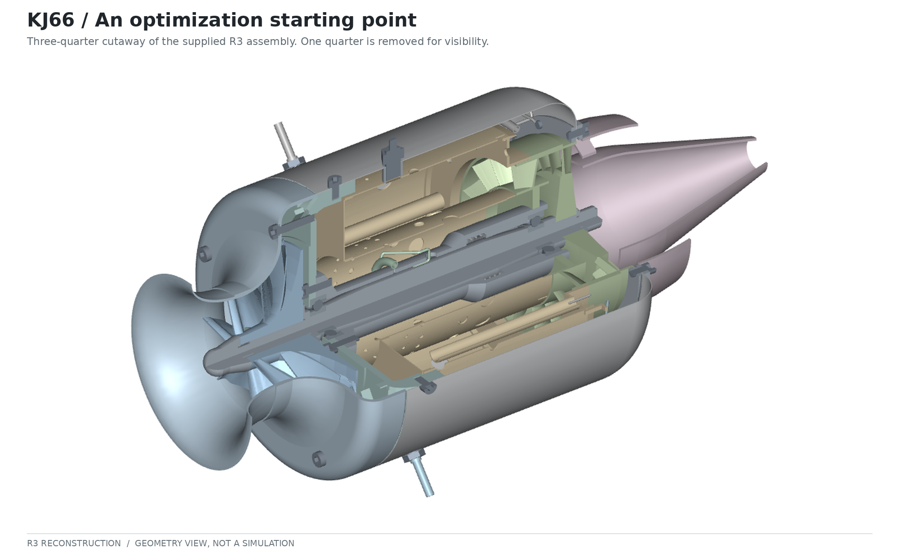
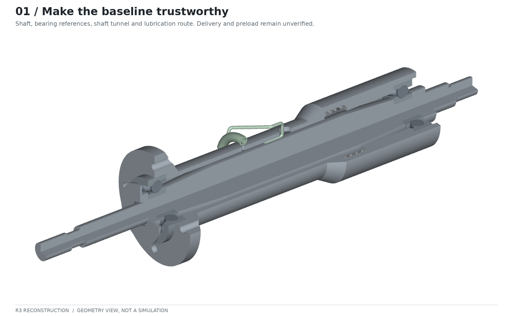
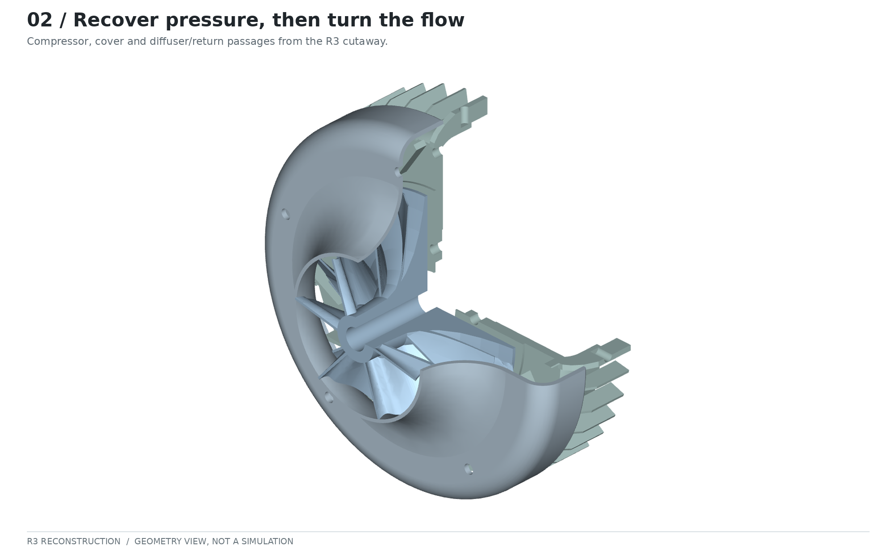
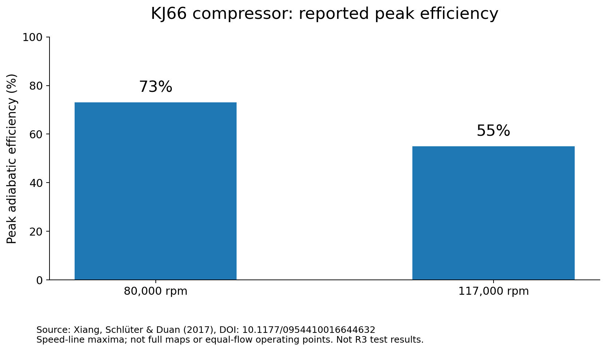
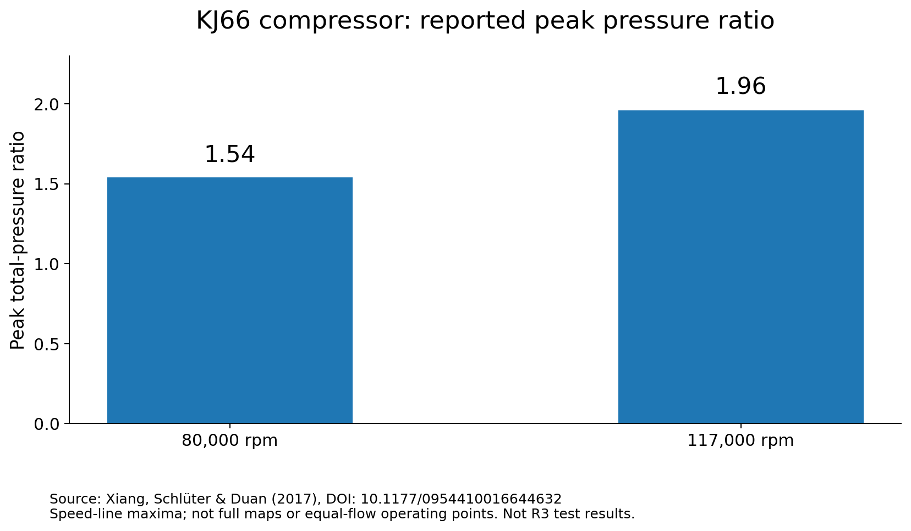
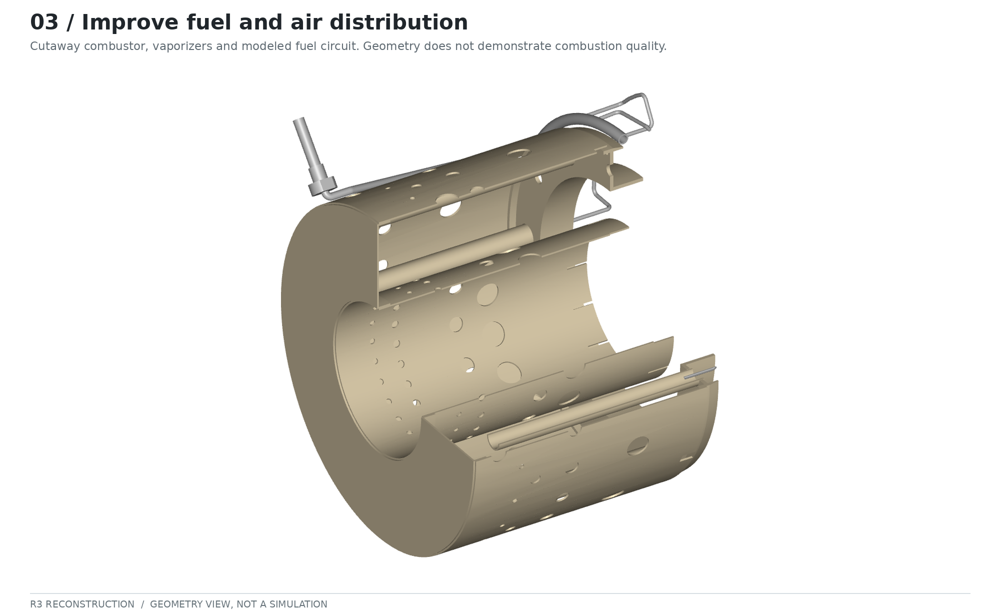
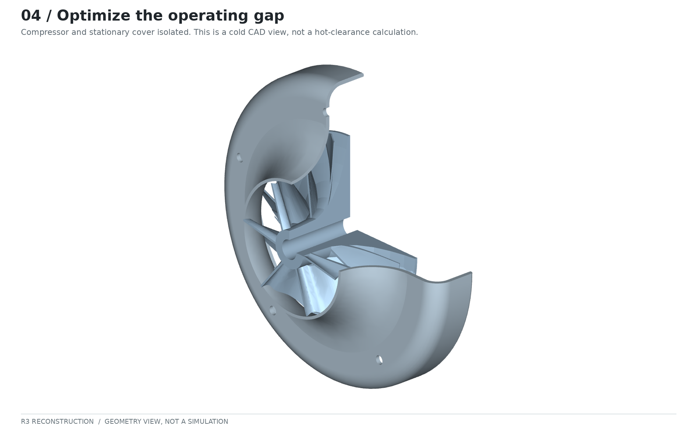
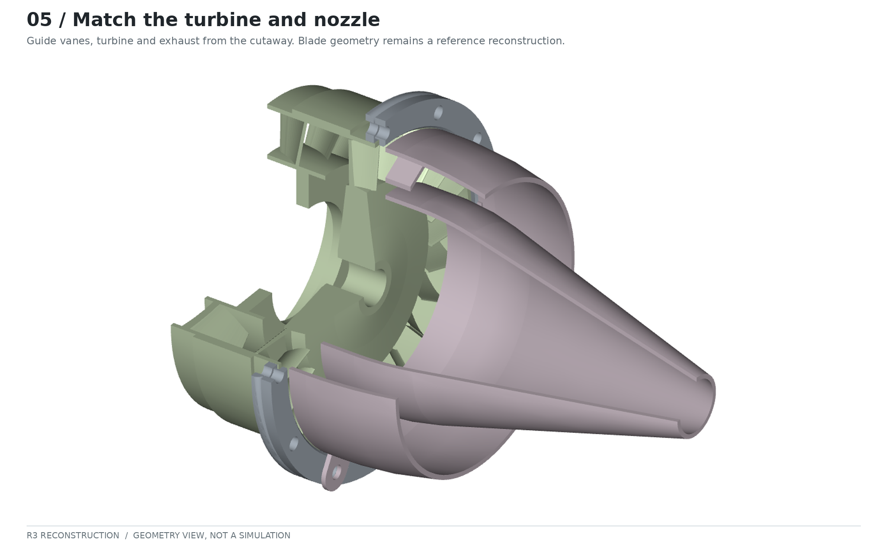
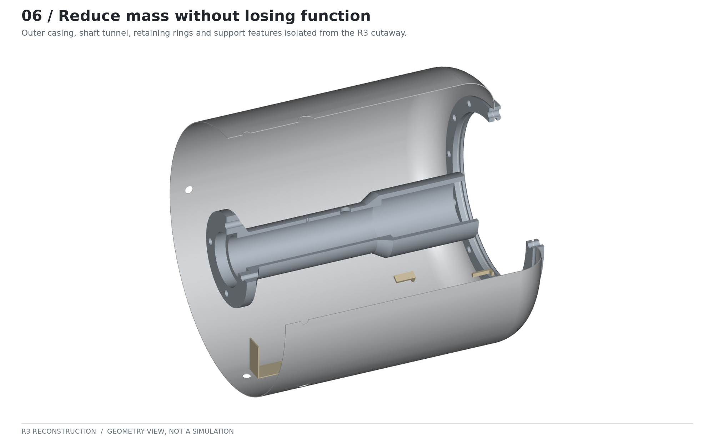
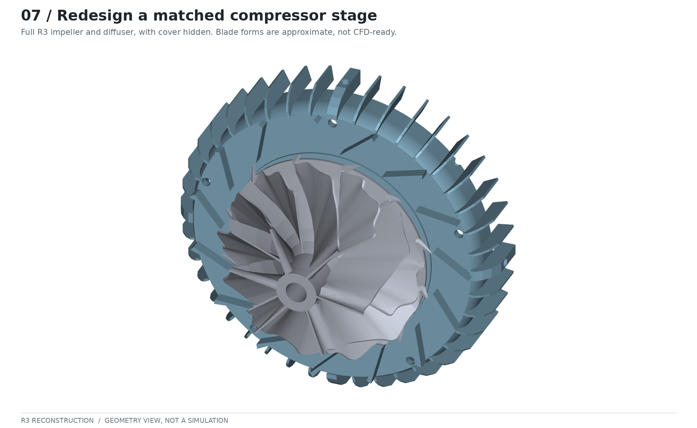

*A practical development plan—from a reconstructed engine to improvements that can be measured.*



*Figure 1. The current R3 reconstruction, rendered directly from the supplied STEP file. This is a geometry visualization, not a tested engine or a simulation result. Some blade and bearing geometry remains approximate.*

The interesting question about the KJ66 is no longer simply whether I can reproduce its shape. It is whether I can make a defensible improvement—and explain why it works.

The design remains an appealing starting point. The Gas Turbine Builders Association describes an engine that can be:

> “built in the average model engineers workshop”

That accessibility is a reason to study it, not evidence that every part is easy to manufacture or that its performance is already optimal. [GTBA][gtba]

My aim is **more sustained thrust for the mass carried, with less fuel consumed at the thrust actually needed**. I would pursue that through a controlled sequence: establish the baseline, investigate stationary passages and combustion, resolve operating clearances, reduce installed mass, and only then consider a coordinated aerodynamic-core redesign.

**Project status:** the accompanying R3 review record describes unresolved bearing, lubrication, support and operating-clearance questions. No R3 thrust, fuel-consumption or durability measurements are established by the material used for this article. The proposals below are a development programme—not completed modifications or promised gains. [Project-source details](../../kj66-optimization/SOURCE_NOTES.en.md#project-context)

## Decide what “better” means

I would keep two main objectives visible throughout the project:

```text
Installed thrust-to-weight ratio = sustained thrust / (installed dry mass × g₀)
Thrust-specific fuel consumption = fuel mass flow / thrust
```

The first ratio is dimensionless when thrust and weight are both in newtons. For the second, I would use kilograms per newton-hour, with fuel flow expressed in kilograms per hour. NASA explains TSFC as fuel flow divided by thrust and notes that it changes with speed and altitude. [NASA: specific fuel consumption][tsfc]

For this project, I would define *installed dry mass* to include the engine, retained inlet and exhaust hardware, mounts, starter, controller, pump, valves, plumbing, battery and dry fuel-system hardware. Usable fuel would be excluded and reported separately. Test-stand equipment would not count. Bare-engine mass would remain a secondary figure.

That measurement boundary matters: relocating a pump outside the engine does not remove its mass from the aircraft.

Comparisons would use the same fuel specification, ambient conditions, inlet arrangement and measurement method. Fuel economy should be compared at the **same required thrust**, with maximum sustained thrust reported separately. I would also record temperatures, vibration, operating stability and inspection findings as constraints—not trade them away for a better headline number.

## 1. Make the baseline trustworthy



*Figure 2. The shaft-support and lubrication region. A connected passage in CAD does not establish oil delivery at the bearing contacts, correct preload or adequate operating clearance.*

My first optimization task would be to remove uncertainty from the starting point.

The R3 review record explicitly leaves actual bearing oil delivery unverified. It also distinguishes modelled gaps and pipe routes from approved operating clearances and manufactured details. Those are project-specific limitations, not a claim that every KJ66 has defective lubrication. [Project-source details](../../kj66-optimization/SOURCE_NOTES.en.md#project-context)

**What I would establish:** the actual bearing specification, hub interfaces, axial location scheme, preload arrangement, material assignments, pipe supports and manufacturing tolerances. Each critical feature would have a status: verified, assumed or unresolved.

**How I would establish it:** reconcile the drawings, CAD and selected hardware; prepare a tolerance and thermal-growth assessment; then develop an instrumented baseline through an appropriately reviewed test programme. The record would connect geometry revision, configuration, calibration information, operating conditions and observations.

I would start with repeatability rather than a target thrust figure. Until the baseline can be reproduced, an apparent improvement could simply be a different inlet condition, a changed sensor installation or a drifting measurement.

**The first useful deliverable is a trustworthy reference, not another visually detailed model.**

## 2. Recover pressure before redesigning the rotor



*Figure 3. The compressor-stage region. The initial investigation would retain the impeller and vane profiles while examining the surrounding passage walls and downstream turn.*

The diffuser must recover static pressure from the compressor discharge without excessive loss. The return passages then have to turn and distribute that flow. A KJ66 study by Ling, Wong and Armfield investigated a larger impeller together with a rounded diffuser turn. Their simulations improved performance in the intended operating region, but deteriorated at higher flow; the authors associated this with recirculation in the turn. [Ling et al., 2007][ling]

My takeaway is not “install a larger wheel.” It is **optimize the flow path over the region the engine actually uses**.

**What I would vary first:** passage-area progression, hub and shroud contours, the radial-to-axial turn and local restrictions before the combustor. I would keep rotor blades and stationary vane profiles unchanged in this first study. Changing diffuser vanes would be a separately identified aerodynamic redesign.

**How I would compare candidates:** begin with a small parameter set and a cold-flow model. Check mesh sensitivity, consistent boundary conditions and mass conservation. Compare static-pressure recovery, total-pressure loss, separation and combustor-entry flow distribution at several relevant operating points.

A more uniform outlet is not automatically a success if achieving it consumes too much pressure. Likewise, an attractive design-point result is insufficient if the passage becomes unsuitable elsewhere in the operating range.

**Acceptance criterion:** an improvement that survives whole-engine evaluation, rather than merely a smoother-looking passage or a more attractive contour plot.

### Why not simply increase RPM?

The KJ66 compressor study by Xiang, Schlüter and Duan gives a useful warning. Between its simulated 80,000 and 117,000 rpm speed lines, peak pressure ratio rose from 1.54 to 1.96 while peak adiabatic efficiency fell from 73% to 55%. The authors describe:

> “decreasing the peak adiabatic efficiency from 0.73 to 0.55”

These are results for that compressor—not a universal speed rule. The pressure and efficiency maxima need not occur at the same mass flow, and neither is whole-engine efficiency. [Xiang et al., 2017][xiang]



*Figure 4. A new plot of the published efficiency maxima, not a reproduction of the paper’s full compressor map. These are not R3 measurements. [Source][xiang]*



*Figure 5. The separately reported pressure-ratio maxima. Higher peak pressure does not, by itself, demonstrate better engine fuel economy. [Source][xiang]*

## 3. Improve fuel distribution and combustion together



*Figure 6. The reconstructed combustor and fuel routes. The image locates the subsystem; it does not show a measured fuel split, flame shape or temperature field.*

Capata and Achille criticized the stock KJ66 mixing arrangement as producing:

> “a rather inhomogeneous mix of air and fuel”

Their paper explored a different, larger 50 kW power-generating concept derived from the KJ66 layout. It motivates investigation, but does not quantify a transferable fuel-saving benefit for this R3. The authors also state that a complete combustion-chamber simulation was beyond their available computational resources. [Capata and Achille, 2018][capata]

A separate KJ66-based numerical study by Wang and Luo found that combustor–turbine interaction and the relative circumferential positioning of components affected aerodynamic performance, thermal loading and emissions. That is a reason to examine what reaches the turbine—not just what happens inside the liner. [Wang and Luo, 2024][wang]

**What I would optimize:** the intended fuel split, evaporation, combustor air admission, pressure loss and turbine-inlet temperature distribution.

**How I would investigate it:** first characterize branch delivery on a controlled, non-firing flow setup, including repeatability and leakage. Then investigate the airflow distribution separately. Only after those foundations would I move to reacting-flow analysis and appropriately reviewed combustion testing.

Equal tube lengths would remain a geometric fact, not proof of equal delivery. A cold-flow calculation could inform air distribution, but would not establish combustion efficiency or flame stability.

**Acceptance criterion:** lower TSFC at the agreed thrust, with acceptable pressure loss, temperature distribution and stability. I would initially use improved temperature uniformity to preserve operating margin—not automatically turn it into permission to add more fuel.

## 4. Optimize the operating clearance—not the cold CAD gap



*Figure 7. The compressor/cover interface in the cold reconstruction. No validated clearance dimension or hot deformation is shown.*

Tip clearance is both an aerodynamic and a mechanical problem. In a numerical study of mixed-flow compressor stages—not the present KJ66—van Eck and colleagues found that smaller clearance improved pressure ratio and efficiency. However, stall and choke margins did not respond in the same direction. A smaller gap was not an unqualified improvement in every respect. [van Eck et al., 2023][clearance]

**What I would optimize:** a repeatable operating gap that meets aerodynamic objectives while preserving mechanical and stability margins.

As first-order bookkeeping, I would write:

```text
Minimum operating gap ≈ cold gap + casing growth − rotor growth
                        − remaining gap-closing allowances
```

The underlying geometric idea—casing radius minus the changing rotor-and-blade envelope—is also used in published dynamic-clearance modelling. [Dynamic tip-clearance study, 2023][thermal]

**How I would evaluate it:** use component-specific temperatures and deformations, include centrifugal effects and bearing motion, and account for runout and manufacturing tolerances without double-counting them. I would examine transient conditions as well as the steady operating point. One exhaust-gas temperature would not be assigned to every metal component.

The same exercise would cover axial clearances, shaft-to-pipe spacing and combustor supports. For the present reconstruction, these are unresolved design checks rather than opportunities to shave a few arbitrary fractions of a millimetre.

**Acceptance criterion:** no predicted interference within the justified tolerance and operating envelope, with the remaining margin and uncertainty explicitly documented. This article does not prescribe a machining clearance.

## 5. Match the turbine and nozzle to the compressor



*Figure 8. The turbine and exhaust region. Component shapes are shown for orientation; the image is not evidence of correct aerodynamic matching.*

An improved compressor still has to be driven by the turbine. The BMT120 KS upgrade study illustrates the difficulty: redesigned component combinations encountered excessive temperatures at high speed when additional fuel was needed to provide the required turbine work. Its authors investigated the problem through component matching, not by assuming that better individual components must produce a better engine. [Oppong et al., 2017][oppong]

The exhaust belongs in the same analysis. NASA’s thrust equation contains both momentum and exit-pressure terms; changing the outlet shape is not equivalent to guaranteeing a thrust gain. [NASA: thrust equation][thrust]

**What I would optimize:** the operating combination of compressor, combustor, turbine and nozzle—not the exhaust cone in isolation.

**How I would evaluate it:** use a whole-engine model that balances mass flow and shaft power. Compare candidate nozzle areas and contours against thrust, TSFC, temperatures and compressor operating position. Any upstream modification would trigger a new matching check.

For shortlisted designs, turbine-inlet non-uniformity and losses would deserve closer attention, rather than assuming a uniform inlet simply because the engine model uses an averaged temperature.

**Acceptance criterion:** the engine meets the required sustained operating points without depending on excessive temperature, reduced stability or an unjustified speed increase.

## 6. Remove dead weight, not engineering margin



*Figure 9. Structural and support components. This is not a complete installed system: external accessories and their masses are not shown.*

For mass reduction, I would start with a weighed and traceable parts list, not a thinner casing.

Commercial designs show that integration is a separate development direction from core aerodynamics. JetCat’s P100-RX-BL description, for example, discusses integrated valves and reduced external hose and cable connections. That demonstrates an integration approach; it does not establish a particular mass saving for a KJ66 retrofit. [JetCat][jetcat]

**What I would investigate first:** redundant brackets, duplicated interfaces, fitting count, plumbing routes and accessory packaging. I would compare the entire installation rather than only the bare engine.

**How I would assess a change:** assign materials and manufacturing processes, reconcile CAD estimates with measured or supplier masses, then check stiffness, temperature exposure, vibration, access and maintainability. A consolidated part must still be manufacturable, inspectable and replaceable where necessary.

The R3 combustor’s consolidation into a single CAD solid is not, by itself, a physical mass reduction or proof of a viable one-piece manufacturing process.

I would leave rotor, shaft, bearing-support and pressure-casing material removal out of the first lightweight iteration unless supported by appropriate structural and thermal analysis.

**Acceptance criterion:** lower installed mass with the required function and margins retained. Moving mass out of the drawing is not the same as removing it from the aircraft.

## 7. Then redesign the aerodynamic core as a system



*Figure 10. A full-geometry view of the reconstructed compressor stage. The approximate blade forms are suitable for orientation, not for claiming a validated aerodynamic baseline.*

A more ambitious phase would redesign the impeller and diffuser together, then evaluate that stage against the turbine and nozzle.

Guo and colleagues used a design-of-experiments and CFD workflow to optimize an SR-30 compressor for efficiency, pressure ratio and input power. They varied impeller exit radius, impeller exit blade angle and diffuser inlet blade angle. The selected compressor’s experimental test showed:

> “a 7.5% increase in pressure ratio”

That is a compressor result on another engine—not a 7.5% thrust increase or a prediction for the KJ66. [Guo et al., 2014][guo]

**What I would change:** initially a small, interpretable set of parameters, rather than allowing an optimizer to alter every surface at once.

**How I would search:** establish trustworthy geometry, sample the design space, run CFD at multiple operating points, identify sensitive parameters and compare trade-offs. A response-surface or surrogate model could accelerate the search, but finalist designs would return to direct simulation and mechanical assessment.

I would retain a set of non-dominated candidates: designs for which improving one objective requires sacrificing another. That makes the trade-off visible instead of concealing it inside one convenient score.

**Acceptance criterion:** an aerodynamic improvement that survives engine matching, structural checks, manufacturing constraints and experimental validation.

## How I would organize the next iteration

The sequence below is my proposed programme. None of these stages is claimed to be complete.

| Stage | Main question | Evidence required before advancing |
|---|---|---|
| Establish the baseline | Do the geometry, hardware and measurements describe the same engine? | Resolved critical interfaces, documented assumptions and repeatable reference data. |
| Investigate non-blade changes | Can stationary passages, fuel distribution and installation improve the objectives? | Comparable component results and whole-engine predictions, with uncertainty and constraints. |
| Develop the matched core | Is a new impeller/diffuser/turbine combination worth the added complexity? | Credible geometry, compatible flow and power requirements, and acceptable mechanical margins. |
| Validate the improvement | Does the manufactured change deliver what was predicted? | Repeatable measurements, inspection findings and an explanation of model–test differences. |

I would connect those stages with a hierarchy of models. Deng and colleagues demonstrated a KJ66 approach that embeds compressor and turbine CFD within a lower-order engine model and compares off-design predictions with reference ground-test data. It provides a useful precedent for connecting component analysis to engine behaviour—not evidence that this project already has such a model. [Deng et al., 2024][deng]

My working loop would be:

```text
Define one hypothesis → create a controlled geometry variant
→ evaluate the component → rematch the engine
→ assess thermal and mechanical constraints
→ test the justified candidate → update the model
```

Each variant would have one primary question. Successful changes could then be combined and checked again for interactions.

The test record would include geometry revision, mass boundary, fuel specification, operating conditions, thrust and fuel-flow data, temperature measurements, calibration and repeatability. I would report a gain alongside its uncertainty, and avoid calling it established when the measurements cannot distinguish it from the baseline.

High-speed or fired testing requires a separately reviewed installation, appropriate containment, remote operation, instrumentation and protective limits. This post is a research roadmap, not a fabrication release or an operating procedure.

## What success would look like

I would begin with a verified baseline, then set targets relative to it. For example, **10% lower TSFC at the agreed thrust** could be a useful research target. It is not a forecast, and it would not be accepted at the expense of required sustained output or durability.

The arithmetic behind combined objectives is encouraging. Hypothetically, 10% more thrust and 10% less installed mass would change thrust-to-weight by:

```text
1.10 / 0.90 = 1.222…  →  a 22.2% increase
```

That calculation says nothing about whether both changes are feasible, or what they would do to fuel use. The engineering work is to find out.

For my KJ66, the strongest next research topic is therefore a **retained-rotor diffuser and return-passage study, built on a verified lubrication and clearance baseline**, with installed-mass accounting running alongside it.

The objective is not a more impressive render or a higher number on one test run. It is a better engine—and a clear, reproducible explanation of what made it better.

---

## Sources and further reading

The short quotations above are direct excerpts. The proposed experiments, acceptance criteria and development sequence are this article’s engineering proposals. Results from other engines are identified as such; numerical results are not presented as measurements of R3.

**1. Gas Turbine Builders Association.** [KJ66 design description][gtba]. Historical design, construction and materials context.

**2. NASA Glenn Research Center.** [Specific Fuel Consumption][tsfc]. TSFC definition and the importance of operating conditions.

**3. Xiang, J.; Schlüter, J. U.; Duan, F. (2017; first online 2016).** [Study of KJ-66 micro gas turbine compressor: Steady and unsteady Reynolds-averaged Navier–Stokes approach][xiang]. DOI: 10.1177/0954410016644632.

**4. Ling, J.; Wong, K. C.; Armfield, S. (2007).** [Numerical Investigation of a Small Gas Turbine Compressor][ling]. 16th Australasian Fluid Mechanics Conference, pp. 961–966. Author-uploaded conference paper.

**5. Capata, R.; Achille, M. (2018).** [Design and Optimization of Fuel Injection of a 50 kW Micro Turbogas][capata]. *Designs*, 2(2), 14. DOI: 10.3390/designs2020014.

**6. Wang, H.; Luo, K. H. (2024).** [Fully Coupled Whole-Annulus Investigation of Combustor–Turbine Interaction with Reacting Flow][wang]. *Energies*, 17(4), 873. DOI: 10.3390/en17040873.

**7. van Eck, H.; van der Spuy, S. J.; Gannon, A. J. (2023).** [The Effect of Impeller Tip Clearance on the Performance of a MGT Mixed Flow Compressor Stage Fitted with a Crossover Diffuser][clearance]. *Aerotecnica Missili & Spazio*, 102, 219–231. DOI: 10.1007/s42496-023-00160-x.

**8. Chinese Journal of Aeronautics (2023).** [New model-based method for aero-engine turbine blade tip clearance measurement][thermal]. Used for the dynamic-clearance geometric relationship, not as a KJ66 clearance specification.

**9. Oppong, F.; van der Spuy, S. J.; von Backström, T. W. (2017).** [Upgrading the BMT120 KS micro gas turbine][oppong]. *R&D Journal*, 33, 22–31.

**10. NASA Glenn Research Center.** [Thrust Equation][thrust]. Momentum and pressure contributions to thrust.

**11. JetCat.** [P100-RX-BL product description][jetcat]. Manufacturer example of accessory integration; not an independent comparison test.

**12. Guo, S.; Duan, F.; Tang, H.; Lim, S. C.; Yip, M. S. (2014).** [Multi-objective optimization for centrifugal compressor of mini turbojet engine][guo]. *Aerospace Science and Technology*, 39, 414–425. DOI: 10.1016/j.ast.2014.04.014.

**13. Deng, W.; Wei, Z.; Ni, M.; Gao, H.; Ren, G. (2024).** [Direct multi-fidelity integration of 3D CFD models in a gas turbine with numerical zooming method][deng]. *Journal of the Global Power and Propulsion Society*, 8, 166–176. DOI: 10.33737/jgpps/186054.

*Prepared 4 October 2026. See [image credits](../../kj66-optimization/IMAGE_CREDITS.en.md) for the origin and limitations of the local illustrations.*

[gtba]: https://gtba.co.uk/engine_designs/kj66.php
[tsfc]: https://www.grc.nasa.gov/www/k-12/airplane/sfc.html
[xiang]: https://journals.sagepub.com/doi/10.1177/0954410016644632
[ling]: https://www.researchgate.net/publication/43472634_Numerical_Investigation_of_a_Small_Gas_Turbine_Compressor
[capata]: https://www.mdpi.com/2411-9660/2/2/14
[wang]: https://www.mdpi.com/1996-1073/17/4/873
[clearance]: https://link.springer.com/article/10.1007/s42496-023-00160-x
[thermal]: https://www.sciencedirect.com/science/article/pii/S1000936122002205
[oppong]: https://scielo.org.za/scielo.php?pid=S2309-89882017000100009&script=sci_arttext
[thrust]: https://www1.grc.nasa.gov/beginners-guide-to-aeronautics/thrust-force/
[jetcat]: https://www.jetcat.de/en/productdetails/produkte/jetcat/produkte/RC%20ENGINES/Engines/p100_rx-bl
[guo]: https://doi.org/10.1016/j.ast.2014.04.014
[deng]: https://doi.org/10.33737/jgpps/186054
