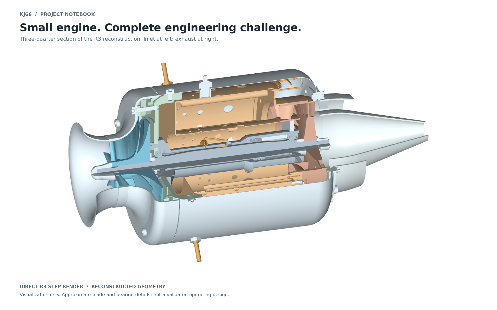
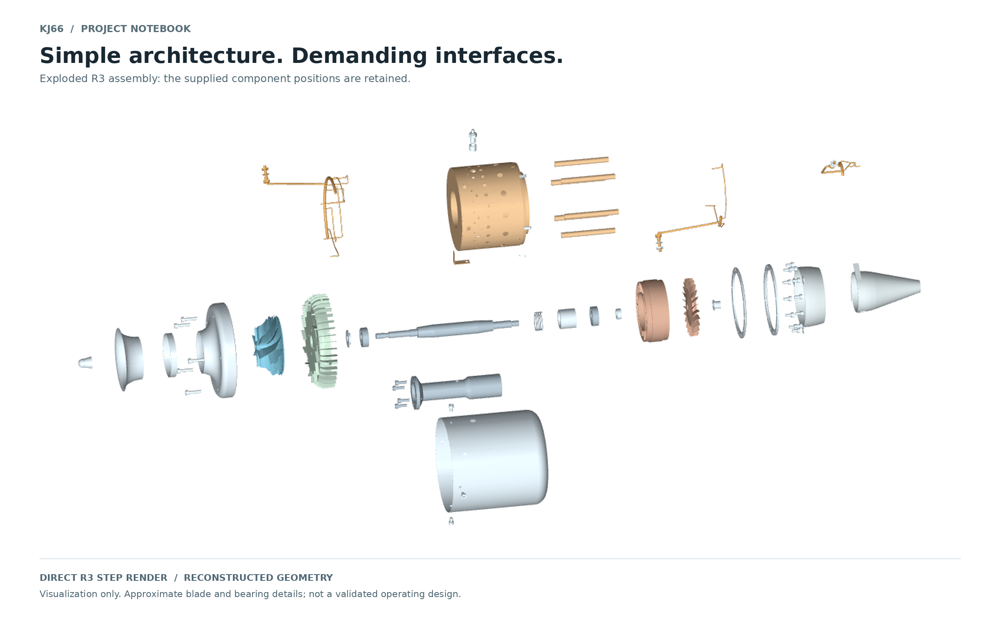
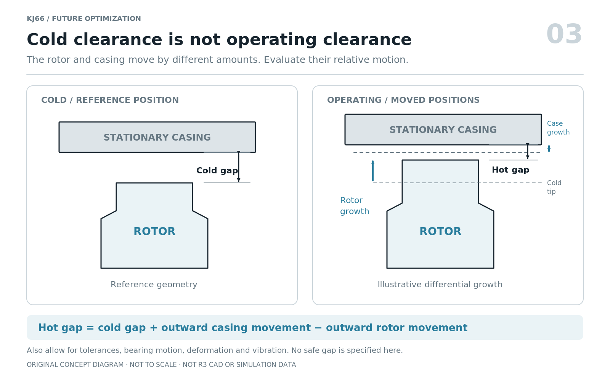
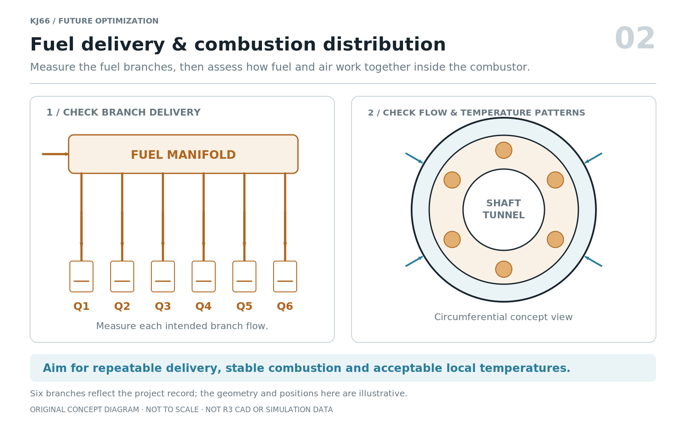
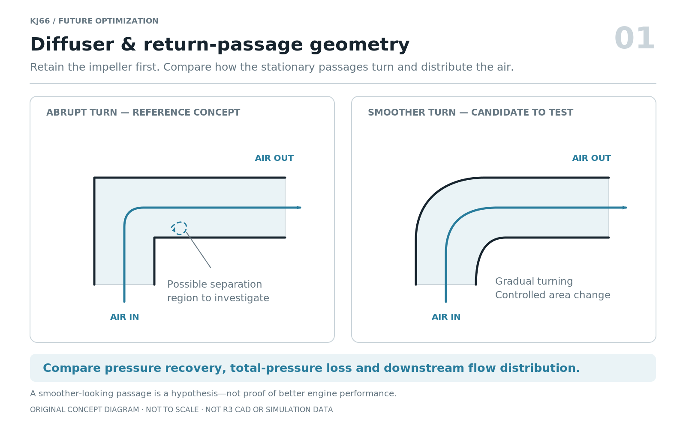
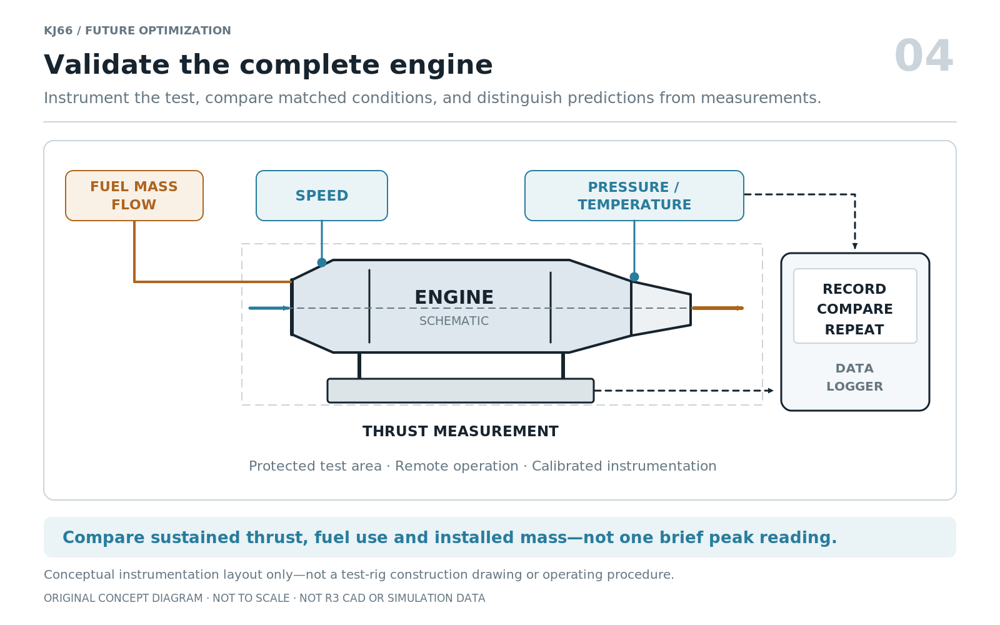

*Why I see it as a valuable starting point—not an automatic answer to every propulsion problem.*

*Figure 1. Rendered directly from the project's R3 three-quarter-section STEP file. This is reconstructed CAD geometry, not a photograph, a simulation result, or a manufacturing release. Blade and bearing details include approximations.*

A small jet engine is easy to admire from the outside. A cutaway makes it more interesting: the compressor, combustion chamber, turbine, shaft, and supports all have to work together inside one compact package.

Working through a KJ66 reconstruction has made me ask a more useful question than “How much thrust can it make?” **What is this engine a good starting point for—and what difficulties come with that choice?**

My view is that the KJ66 is especially compelling as a learning and development platform. That does not mean it is the easiest engine to build, the most economical propulsion system, or a shortcut to reliable flight hardware.

One distinction matters throughout this post: **the historical KJ66 and this project's R3 model are not the same evidence.** The project record identifies R3 as a review-stage reconstruction, with unresolved lubrication, bearing, and operating-clearance questions. I do not treat published KJ66 performance as measured performance of this model.

## First, what is the KJ66?

The KJ66 is a miniature turbojet with a centrifugal compressor, a combustion chamber, and an axial turbine. Compressor and turbine operate on a common shaft. A 2024 whole-engine modelling study describes this arrangement and uses published sea-level test data for comparison. [2][gpps]

For a sense of scale, the Gas Turbine Builders Association gives the following historical reference figures. [1][gtba]

| Property | GTBA historical reference |
|---|---:|
| Outside diameter | 110 mm |
| Length | 240 mm |
| Engine mass | 0.93 kg |
| Thrust | 75 N |
| Maximum rotational speed | 117,000 RPM |

These figures describe the source's reference engine. They are not guaranteed values for every KJ66-derived build, an approved operating envelope for R3, or a complete installed-system specification.

## The advantages: why I would start here

### 1. It makes the whole engine understandable

For me, the strongest advantage is educational. The architecture is compact enough to follow as one connected system: air enters the compressor, receives heat in the combustor, passes through the turbine, and leaves through the exhaust. The turbine must provide the shaft work needed by the compressor. [2][gpps]

That creates an unusually useful project notebook. A discussion of the compressor can lead naturally to the diffuser, fuel distribution, bearing supports, thermal growth, and measurement. I would rather learn those relationships on a defined reference design than attempt to invent every interface at once.

The benefit is not that the engineering becomes easy. It is that the engineering becomes easier to organize.

### 2. It has a practical fabrication heritage

GTBA describes a design intended for a model-engineering workshop, using a turbocharger-derived compressor and a properly profiled cast turbine. That history is appealing because it connects an engine layout to recognizable fabrication methods—not just attractive computer geometry. [1][gtba]

There is also a useful first-hand example: Max Prototypes says it built a KJ66-type engine to become familiar with the materials and techniques before developing its own M400. That supports the idea of using an existing design as preparation; it is not a guarantee that every builder will achieve the same progression. [4][max]

My takeaway is to use the KJ66 to learn sound engineering habits, not to assume that all of its parts are ordinary workshop components.

### 3. There is published research to build on

The KJ66 is not limited to hobby discussion. Xiang, Schlüter, and Duan studied its compressor using steady and unsteady computational fluid dynamics, or CFD. Deng and colleagues later coupled detailed compressor and turbine calculations to a whole-engine model. [3][xiang] [2][gpps]

For this project, those papers provide useful questions and modelling approaches. They help define what to investigate and how to compare components with the engine they serve.

They do not validate my reconstructed blades. But having relevant research is a real advantage over starting with a design for which almost nothing is documented.

### 4. It supports a manageable development programme

I would use the existing layout to create small, controlled investigations. One revision could examine a return passage. Another could examine fuel delivery. A third could assess support geometry or accessory mass.

That is a proposed way of working, not a claim that the original KJ66 was designed as a modular research rig. Its attraction is that I can ask one question at a time, retain the baseline, and explain why a change was kept or rejected.

For a personal engineering blog, that is valuable: the story becomes a sequence of decisions and evidence rather than a sequence of increasingly elaborate renders.

*Figure 2. The supplied R3 exploded arrangement, rendered without redesigning the parts. It makes component relationships visible; it does not prove that the interfaces, materials, or clearances are ready for manufacture.*

## The disadvantages: where the appeal needs qualification

### 1. A compact turbojet is not automatically an economical propulsion system

The absence of a large fan or propeller is part of a turbojet's appeal, but it also defines its propulsion trade-off. NASA explains how bypass flow allows a turbofan to generate additional thrust with relatively little change in core fuel flow. A turbojet does not receive that same bypass contribution. [6][nasa-fan]

For a slower, endurance-focused aircraft, I would therefore compare alternative propulsion architectures before assuming that a more efficient KJ66 core is the best answer. That is a mission-level judgement, not a measured comparison between R3 and a particular propeller installation.

The metric I would track is **thrust-specific fuel consumption**, or TSFC: fuel mass flow divided by thrust. NASA notes that it changes with speed and altitude, so comparisons must state their conditions. [5][nasa-sfc]

A strong static thrust figure is useful. It is not enough to establish endurance, flight economy, or the fuel mass an aircraft must carry.

### 2. Simple architecture does not mean forgiving mechanics

The R3 record makes this concrete. Its bearing specification, preload arrangement, lubricant delivery, and thermal-clearance assumptions remain unresolved. Those are limitations of the current reconstruction, not evidence that every original KJ66 has defective bearings or lubrication.

A visible gap in cold CAD is only the starting condition. The development record correctly identifies the need to consider differential thermal movement, centrifugal growth, tolerances, and bearing motion before judging operating clearance.

Research on other microturbine compressor stages adds another qualification: reducing tip clearance improved pressure ratio and efficiency, but stall and choke margins changed differently. Smaller is not automatically better in every respect. Those results concern the studied mixed-flow stages, not this R3 geometry. [7][clearance]

For me, this is the central mechanical disadvantage: apparent simplicity can conceal a demanding tolerance and temperature problem.

*Figure 3. Cold clearance is not operating clearance. This supplied concept diagram illustrates relative movement; it specifies no safe gap and does not predict R3 deformation.*

### 3. Fuel and combustion systems need more than tidy pipe routing

R3's intended fuel circuit has six branches feeding six vaporizers. The project record also says that its piping remains a review design and that actual bearing oil delivery has not been verified. Connected bores in a CAD model are not the same evidence as a functioning delivery system.

My concern is therefore not merely whether the tubes fit. I would want to establish the intended fuel distribution, its repeatability, and its interaction with the air entering the combustor. I would assess combustion stability and temperature distribution rather than judge success from one exhaust reading.

That makes the project richer as a learning exercise, but more demanding as a route to usable hardware. A neat assembly does not remove the work of understanding what flows through it.

*Figure 4. The six-branch concept reflects the project's stated arrangement. Positions and proportions are illustrative, not exact KJ66 geometry; no measured flow or temperature distribution is shown.*

### 4. Higher RPM and better individual parts do not guarantee a better engine

A KJ66-specific compressor study provides a useful warning. In the authors' simulations, increasing speed from 80,000 to 117,000 RPM raised peak total-pressure ratio from 1.54 to 1.96, while peak adiabatic efficiency fell from 0.73 to 0.55. These are peak compressor-map quantities, not whole-engine efficiencies or a universal rule about rotational speed. [3][xiang]

The practical lesson I take from this is to avoid optimizing one headline number. More pressure may come with a larger shaft-power requirement. The compressor and turbine still have to operate together, which is precisely why whole-engine matching matters. [2][gpps]

My first aerodynamic proposal would retain the existing rotor and investigate the surrounding diffuser and return passages. I would keep stationary vane profiles unchanged in that initial study as well. Candidates would need to demonstrate a useful benefit across the required operating region, not merely look smoother.

*Figure 5. A candidate research direction, not a proven improvement. The arrows are explanatory, not CFD streamlines. A smoother-looking passage still needs pressure-loss, flow-distribution, and engine-matching assessment.*

### 5. The complete installation is a bigger project than the engine core

A bare engine model does not represent everything needed to operate it. In my mass and integration budget, I would include the starter, controller, pump, valves, plumbing, mounts, and required operating battery. I would report fuel separately, then include it in a mission-level comparison.

Modern commercial systems illustrate this integration work. JetCat's P100-RX-BL documentation describes integrated valves, kerosene starting, and reduced external connections. That is a manufacturer-described example of packaging and control development—not an independent reliability comparison or a recommendation to buy that engine. [8][jetcat]

The KJ66's hands-on appeal means accepting more of that integration responsibility in a personal reconstruction. I would not promise lower total cost without a sourcing plan that includes precision parts, failed iterations, instrumentation, and testing.

Nor would I assume that an older drawing reference remains readily available: GTBA's KJ66 page now states that its plans are no longer available there. Historical documentation is valuable, but it is not the same as a currently supported, fully licensed construction package. [1][gtba]

### 6. Testing, noise, heat, and maintenance are part of ownership

A miniature turbine is not an ordinary desktop experiment. GTBA's operating code addresses hot exhaust, fire, ejected components, intake hazards, hearing damage, controlled test areas, and regular inspection. These are general model-turbine responsibilities, not evidence of uniquely poor KJ66 safety. [9][safety]

For this project, I would make engineering review, protective controls, an appropriate test installation, and experienced assistance part of the programme from the beginning. This article and its pictures are not operating instructions.

The time and facilities needed for repeatable testing belong in the decision to pursue the project. They are not incidental costs to discover after manufacturing the attractive parts.

*Figure 6. Measurement is the bridge between a promising design and a demonstrated result. This is an instrumentation concept, not a test-stand construction drawing or a complete safety layout.*

## A fair assessment of this particular project

I would avoid describing every unresolved R3 issue as a “KJ66 disadvantage.” There are three different categories:

| Category | What belongs in it |
|---|---|
| Architecture-level trade-offs | Turbojet propulsion and its suitability for the intended mission. |
| Build-dependent responsibilities | Manufacturing quality, rotor assessment, controls, installation, inspection, and testing. |
| Current R3 limitations | Approximate blade and bearing geometry, unresolved interfaces, and no measured performance baseline established in the supplied record. |

The last category is documented in the project notes; it should not be generalized to all KJ66 engines.

Equally, I would not turn historical success into a reliability rating for a new reconstruction. My evidence standard would be the actual configuration, measurements, inspections, and operating history—not the name on the model.

## What I would improve first

The earlier optimization roadmap remains my proposed next step: establish a credible baseline, then reduce losses without immediately redesigning the rotating assembly.

I would first resolve bearings, lubrication, materials, and operating-clearance assumptions. Alongside that work, I would establish a real mass budget and prepare controlled studies of the diffuser/return passages and fuel distribution. A matched compressor–turbine redesign would be a later decision, supported by trustworthy geometry and engine-level modelling.

Success would mean **more sustained thrust for the installed weight, less fuel at the required thrust, or a more repeatable and durable operating condition**. I would accept none of those as demonstrated until the relevant measurements existed.

The four accompanying concept diagrams are also available as a [single overview image](/jet-engine/images/kj66/pros-and-cons/07-optimization-overview.png).

## My verdict: choose it for the right reason

For understanding small turbojets, investigating a defined layout, and documenting a progression from CAD to evidence, I see the KJ66 as a strong starting point.

For someone whose main objective is a fast route to supported flight hardware, minimum integration effort, or endurance-oriented propulsion, I would evaluate alternatives before committing to a reconstruction.

That is not a dismissal of the engine. It is the reason I find it interesting. **The KJ66 offers an accessible way to see the engineering problem—not a way to avoid it.**

The best outcome for this project would not be a model that merely looks complete. It would be an engine whose strengths, limitations, and improvements can be explained and measured.

---

## References and image notes

The external references below were checked on **4 October 2026**. Historical specifications, published simulations, manufacturer descriptions, project-record statements, and my proposed development priorities are distinguished in the text. No independent performance or durability testing of R3 is reported here.

1. **Gas Turbine Builders Association — [KJ66][gtba].** Historical specifications, construction background, and the notice about unavailable plans. The listed speed is not an operating authorization for this reconstruction.
2. **Deng, W., Wei, Z., Ni, M., Gao, H., and Ren, G. (2024).** [Direct multi-fidelity integration of 3D CFD models in a gas turbine with numerical zooming method][gpps]. *Journal of the Global Power and Propulsion Society*, 8, 166–176. DOI: 10.33737/jgpps/186054. KJ66 whole-engine modelling; not R3 validation.
3. **Xiang, J., Schlüter, J. U., and Duan, F. (2017; online 2016).** [Study of KJ-66 micro gas turbine compressor: Steady and unsteady Reynolds–averaged Navier–Stokes approach][xiang]. *Proceedings of the Institution of Mechanical Engineers, Part G*, 231(5), 904–917. DOI: 10.1177/0954410016644632.
4. **Max Prototypes — [Completed Projects][max].** First-hand description of its KJ66-type engine as preparation for developing the M400. Its hardware and results are separate from this project.
5. **NASA Glenn Research Center — [Specific Fuel Consumption][nasa-sfc].** TSFC definition and dependence on operating conditions.
6. **NASA Glenn Research Center — [Turbofan Thrust][nasa-fan].** Explanation of core and bypass contributions to thrust and fuel economy; general propulsion context, not a KJ66 comparison test.
7. **van Eck, H., van der Spuy, S. J., and Gannon, A. J. (2023).** [The Effect of Impeller Tip Clearance on the Performance of a MGT Mixed Flow Compressor Stage Fitted with a Crossover Diffuser][clearance]. *Aerotecnica Missili & Spazio*, 102, 219–231. DOI: 10.1007/s42496-023-00160-x. Different compressor stages; cited for the clearance/stability trade-off.
8. **JetCat — [P100-RX-BL product documentation][jetcat].** Manufacturer descriptions of integrated valves, starting, and connections. No current price or like-for-like performance ranking is asserted here.
9. **Gas Turbine Builders Association — [Code of Practice for the Safe Operation of Model Gas Turbines, Issue 10][safety].** General engineering and operational guidance; not a substitute for the requirements applicable to a particular engine, installation, or location.

**Images:** Figures 1–2 were rendered directly from the supplied R3 STEP files. Figures 3–6 and the overview are the concept diagrams supplied with this project. They are not third-party paper figures, measured data, or verified manufacturing drawings. See the image captions and provenance notes above.

[gtba]: https://gtba.co.uk/engine_designs/kj66.php
[gpps]: https://doi.org/10.33737/jgpps/186054
[xiang]: https://doi.org/10.1177/0954410016644632
[max]: https://maxprototypes.com/pages/projects
[nasa-sfc]: https://www.grc.nasa.gov/www/k-12/airplane/sfc.html
[nasa-fan]: https://www.grc.nasa.gov/www/k-12/airplane/turbfan.html
[clearance]: https://doi.org/10.1007/s42496-023-00160-x
[jetcat]: https://www.jetcat.de/en/productdetails/produkte/jetcat/produkte/RC%20ENGINES/Engines/p100_rx-bl
[safety]: https://gtba.co.uk/codes/codedoc_22.php
