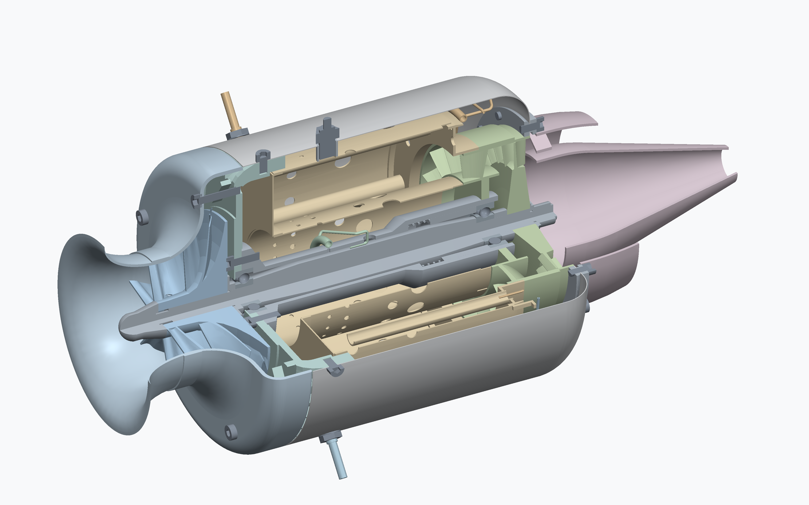
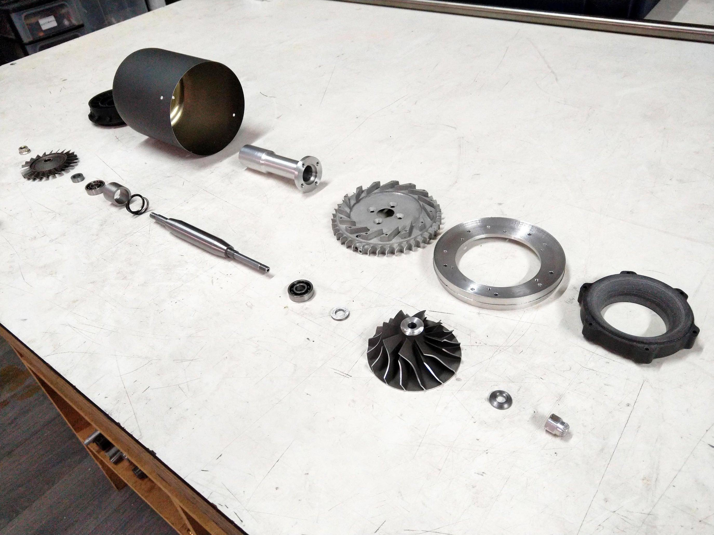
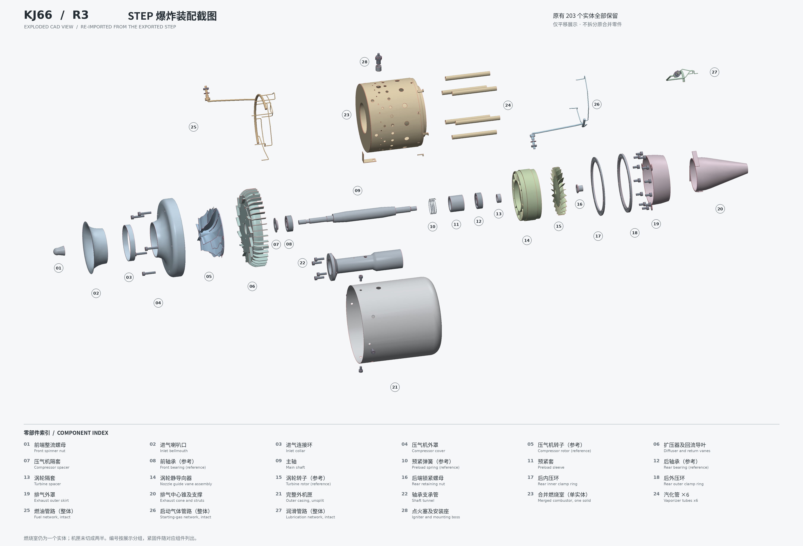

Where should a small jet engine project begin?

I want a starting point I can study carefully: what the engine contains, why its parts are arranged that way, and which problem each change actually addresses. The first stage will focus on an existing design. Original design work and specific thrust targets can develop once there is a clear baseline.

The KJ66 is that starting point for this personal project. **It offers a learning baseline with sources to trace, comparisons to make, and room to study the details progressively.** Judging its performance against current designs would require a defined comparison and evidence.

## What kind of engine is the KJ66?

The KJ66, also written KJ-66, is a small turbojet developed by Kurt Schreckling and Jesús Artés for model aviation. Research describes a single-shaft, fixed-geometry configuration with a single-stage centrifugal compressor and a single-stage axial turbine.[^architecture]

Its main airflow path can be summarized as:

**Inlet → centrifugal compressor → diffuser and return passages → annular combustor → nozzle guide vanes and axial turbine → exhaust nozzle.**[^architecture][^manual]

The turbine extracts energy from hot gas and transmits it through the common shaft to drive the compressor. Energy remaining in the gas accelerates it through the nozzle to produce thrust.[^nasa]

The Gas Turbine Builders Association (GTBA) gives a useful sense of the historical engine's scale:[^gtba]

- Approximately **110 mm in diameter and 240 mm long**.
- A mass of approximately **0.93 kg**.
- Listed thrust of **75 N** and maximum speed of **117,000 rpm**.

These figures describe one historical introduction. They establish neither the performance of this project's R3 model nor operating limits for every KJ66 variant. Different sources and revisions need to retain their provenance rather than being combined into a seemingly definitive specification sheet.

*Figure 2 — The project's R3 CAD cutaway, retaining three quarters of the assembly and removing one quarter to show internal relationships. This reconstruction still contains approximations and details requiring verification.*

## Why start here?

### Understand the structure through traceable material

My source material includes part drawings, an exploded assembly drawing, and an ARTES JET assembly manual. The manual discusses bearing orientation, lubrication-tube positioning, preload checks, and checking the assembly for rubbing.[^manual]

These details matter when modelling. A part's appearance is only the beginning: how it locates, how it is supported, and how it interacts with adjacent parts determine whether the model can support further study.

For me, that makes the project an opportunity to understand engineering relationships as I reconstruct the geometry.

### Define a manageable scope

GTBA describes the KJ66's use of a turbocharger compressor wheel, replacing the homemade wooden wheel of an earlier design. Its turbine uses a cast wheel with shaped blade profiles, and the historical design discusses CNC and model-engineering-lathe approaches to the diffuser.[^gtba]

This encourages me to define the project's boundaries and **concentrate on the parts I can understand and verify**. Each component still demands careful engineering work.

For example, I can first establish the relationships among the casing, shaft supports, combustor, and pipework, then decide which structures deserve redesign. Developing the compressor, turbine, materials, and control system from scratch at the same time would make the first stage much broader.

This is a way of organizing design work. Historical sourcing information gives no guarantee of present availability or suitability of replacement high-speed rotating parts.

### Learn from the path between a model and physical parts

Max Prototypes documents a route close to the one I have in mind. Before developing its M400 engine, the team built an existing KJ66 design to learn about materials and the challenges ahead. Its account shows CAD reconstruction from plans, parts production, and a custom control and data-acquisition setup.[^max]

For me, the value is a visible progression: **understand an existing engine, then move forward within my own manufacturing and measurement capabilities**. I still need to build evidence for what I can achieve.

*Figure 3 — Initial KJ66 parts production by Max Prototypes. Photograph from its [original project page](https://maxprototypes.com/pages/kj66-turbojet-engine), included as a manufacturing reference. These physical parts belong to that team's project.*

*Figure 4 — The project's R3 CAD exploded assembly, used to examine subsystems and interfaces. The merged combustor remains a single component. Bearings, wheels, and other reference geometry require verification before any manufacturing use.*

[Open the original-size exploded view (4400 × 3000) to read the component index](/jet-engine/images/kj66/03-kj66-exploded-bilingual.png).

### Find methods for further analysis

I also want the project to develop beyond a render.

A 2018 preliminary diffuser-design study used existing designs including KJ66, MW54, and TK50 to check its method. A 2022 study investigated multi-objective optimization of guide-vane and rotor profiles for the KJ66 single-stage turbine.[^diffuser][^turbine]

A 2024 paper in the *Journal of the Global Power and Propulsion Society* embedded three-dimensional compressor and turbine CFD models in a component-level engine model and compared predictions with ground-test data.[^gpps]

These studies suggest a gradual approach: understand the structure and simple estimates, study individual components, and then investigate how the components match within a complete engine. Their geometries, boundary conditions, and improvements need their own evaluation before they could inform this reconstruction.

## A historical design still needs verification

The KJ66 is a useful learning baseline. Reconstructing it from historical material leaves important questions about physical operation open.

Source versions need attention even during the first inventory. One set of files I collected has KJ66 in its filename, while the drawing titles identify **Turbine T66**. Those drawings can inform related-design research; using their dimensions for KJ66 requires a compatibility check.[^t66]

Availability also needs a clear record. At the time of preparing this article, GTBA's KJ66 page states that its plans are no longer available. Finding introductions, older drawings, and examples does not establish current access to a complete source package or an open-hardware licence.[^gtba]

The ARTES manual repeatedly addresses bearings, lubrication, and rubbing checks.[^manual] I will therefore record the digital model, engineering analysis, and physical tests separately. Opening a model and checking interference answer different questions from demonstrating reliable operation at temperature.

## How the project will move forward

My goal remains **lower weight, greater sustained thrust, and lower fuel consumption at equivalent thrust within appropriate engineering constraints**. These are directions to verify progressively. There are no project performance results to report yet.

I plan to follow three threads:

- **Organize the baseline.** Keep the sources for dimensions, materials, and interfaces, and distinguish drawing information, reconstruction assumptions, and new design work.
- **Explain one problem at a time.** Begin with pipework, assembly, lubrication, and thermal clearances, then investigate the tradeoffs among passages, the combustor, and weight.
- **Record each change.** Explain what changed, why it changed, the evidence used to judge it, and what remains unverified.

This article presents digital models and project visuals. It reports no physical engine test results. Future simulations and measurements will identify the relevant revision, conditions, and limits; historical KJ66 specifications will retain their own attribution.

After understanding this classic design, I hope to develop my own iterations.

**I want a traceable starting point from which to learn how a jet engine works, and how to judge whether a change represents real progress.**

---

## Sources and references

The web references were checked on **3 October 2026**. Historical descriptions, published research, and this project's model represent distinct kinds of information.

[^architecture]: *Full-engine simulation of micro gas turbine based on time-marching throughflow method*, **Applied Thermal Engineering**, 2022. The publisher's public “Case background” excerpt identifies the developers, model-aviation context, and single-shaft configuration with a centrifugal compressor and axial turbine. [Publisher's page](https://www.sciencedirect.com/science/article/abs/pii/S135943112201136X). This reference uses the public abstract and excerpts; it makes no claim to review the paywalled full text.

[^gtba]: Gas Turbine Builders Association, *KJ66*. [Historical design introduction](https://gtba.co.uk/engine_designs/kj66.php). Source for the listed dimensions, mass, thrust, speed, and design and manufacturing context. The page also states that plans are no longer available; historical purchasing information is not a current availability guarantee.

[^manual]: ARTES JET, *Assembling Manual / KJ66 Kit*, the author's scan named `kj66 manual.pdf`. The author's source notes refer to page 3 for the exploded view, page 12 for system layout, and pages 13–16 for bearings, lubrication, assembly, and rubbing checks. The scan is not redistributed in this article.

[^nasa]: NASA Glenn Research Center, *Turbojet Engines*. [Explanation of operation](https://www.grc.nasa.gov/WWW/k-12/airplane/aturbj.html). A reference for the general shaft-driven compressor and nozzle-thrust principles, with no KJ66-specific dimensions or performance claim.

[^max]: Max Prototypes, *KJ66 turbojet engine*. [The manufacturer's project account](https://maxprototypes.com/pages/kj66-turbojet-engine). Source for its KJ66-before-M400 project route and the CAD, manufacturing, and data-acquisition example. Figure 3 is from this external project and shows that team's physical parts.

[^diffuser]: M. Czarnecki and J. Olsen, *Combined Methods in Preliminary Micro Scale Gas Turbine Diffuser Design – a Practical Approach*, **Journal of Applied Fluid Mechanics**, 2018, 11(3):567–575. DOI:10.29252/jafm.11.03.28150. [Paper page](https://www.jafmonline.net/article_616.html). This article uses the scope described in the public abstract and claims no project performance result from it.

[^turbine]: Q. Tang, H. Wu, and H. Lou, *Multi-Objective Optimization of Aerodynamic Performance for a Small Single-Stage Turbine*, **Journal of Applied Fluid Mechanics**, 2022. DOI:10.47176/jafm.15.05.33561. [Paper page](https://www.jafmonline.net/article_2079.html). A reference for KJ66 component-optimization research; reported improvement percentages are not used as predictions for this project.

[^gpps]: W. Deng, Z. Wei, M. Ni, H. Gao, and G. Ren, *Direct multi-fidelity integration of 3D CFD models in a gas turbine with numerical zooming method*, **Journal of the Global Power and Propulsion Society**, 2024, 8:166–176. DOI:10.33737/jgpps/186054. [Open full-text page](https://journal.gpps.global/Direct-multi-fidelity-integration-of-3D-CFD-models-in-a-gas-turbine-with-numerical,186054,0,2.html). Its specific KJ66 references and ISA sea-level conditions do not establish a measured baseline for this project.

[^t66]: The author's `kj66 drawings1.pdf` and duplicate files. Drawing titles identify **Turbine T66**; the source notes identify page 5 as the compressor guide system and page 7 as the bearing-support tube. Identifying that title leaves dimensional compatibility between versions to be checked.
