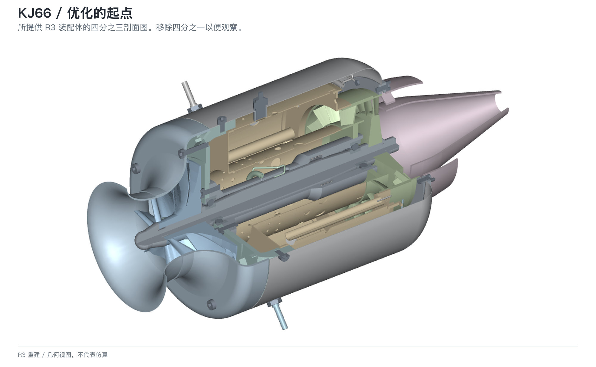
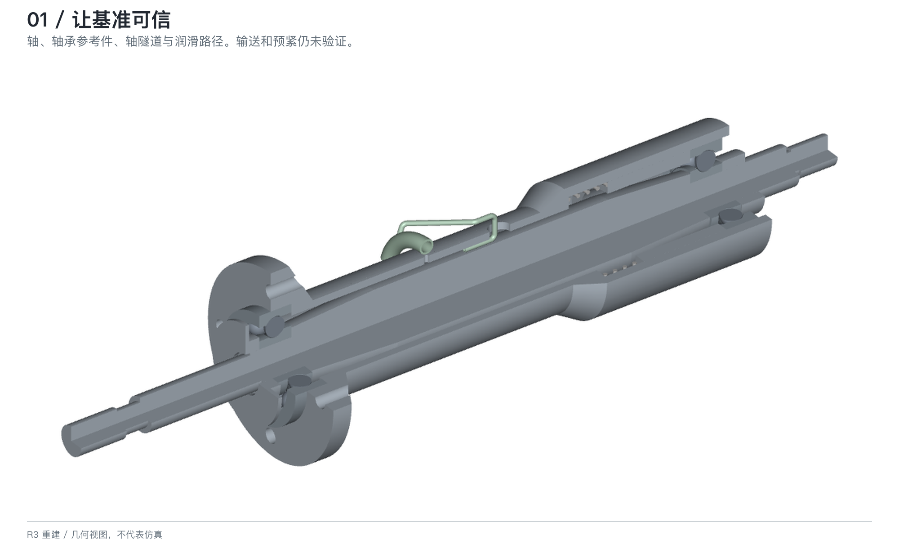
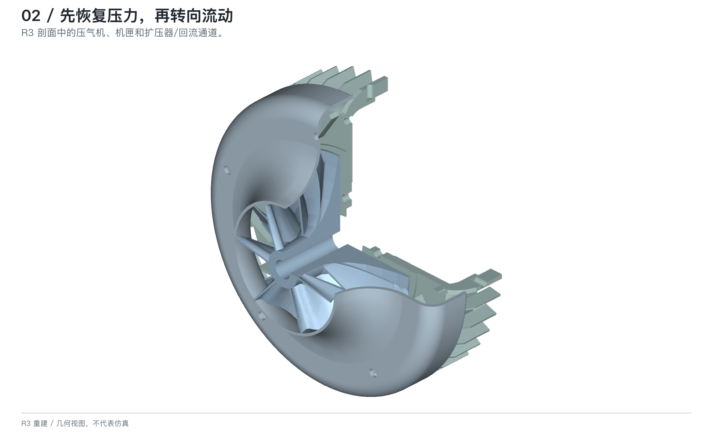
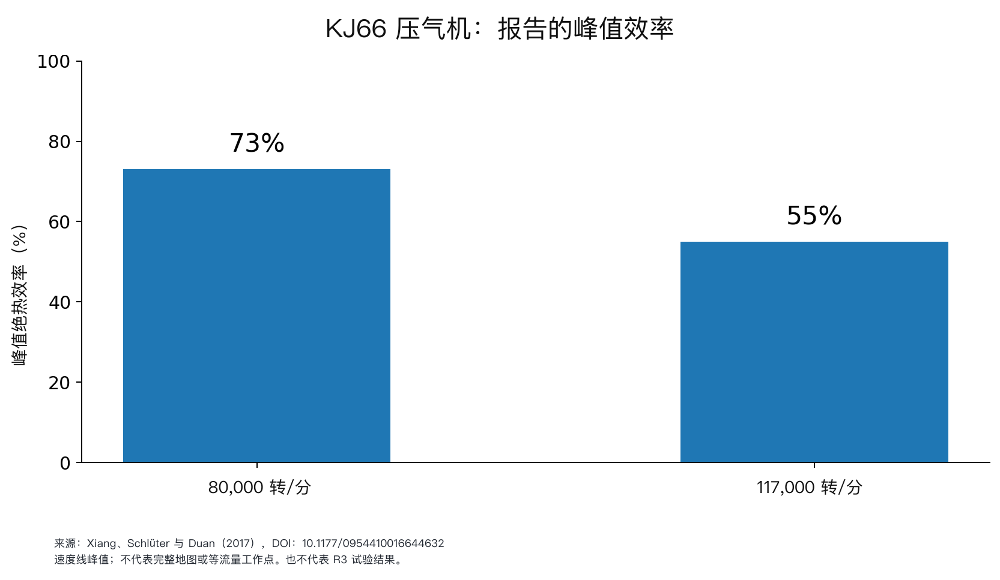
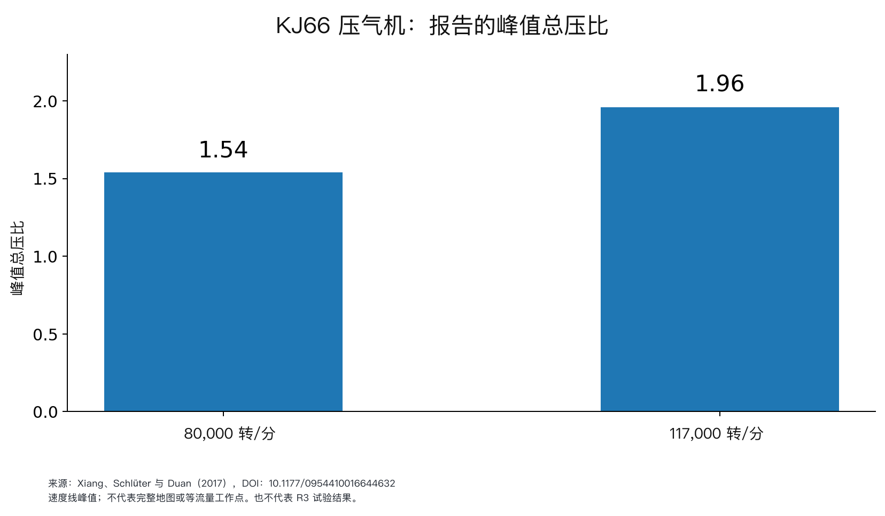
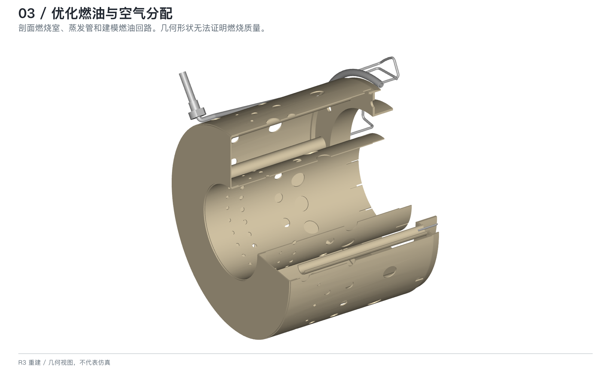
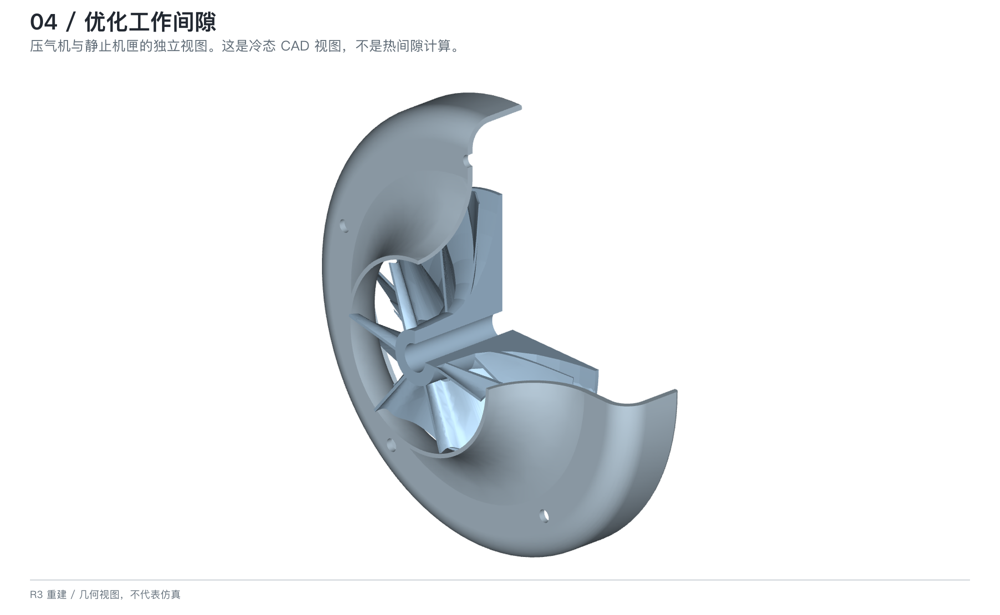
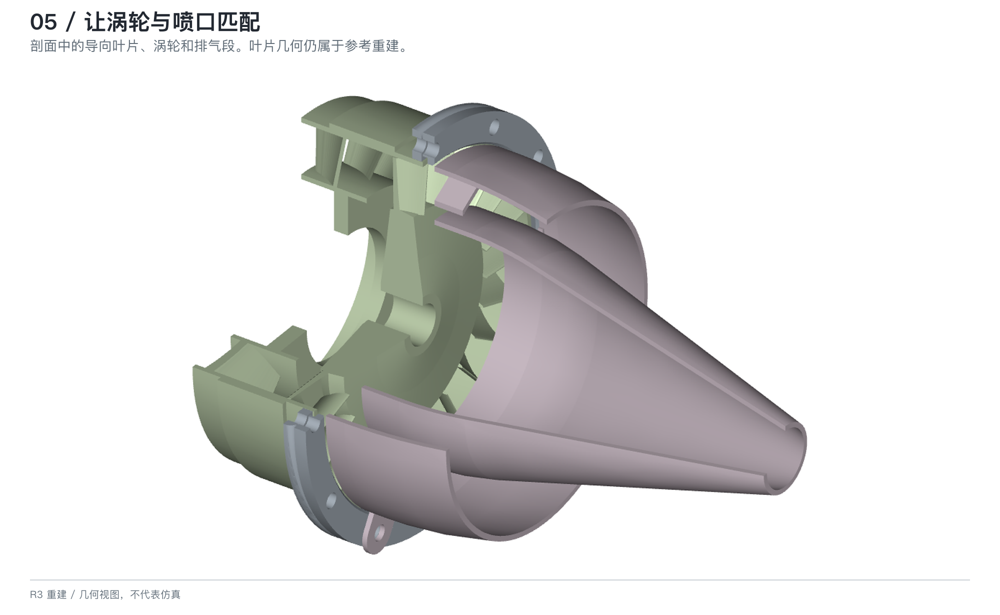
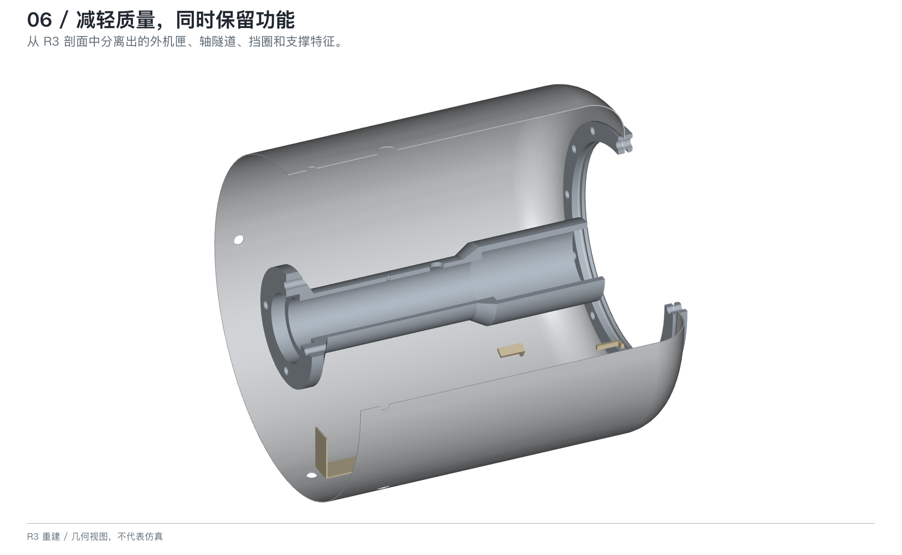
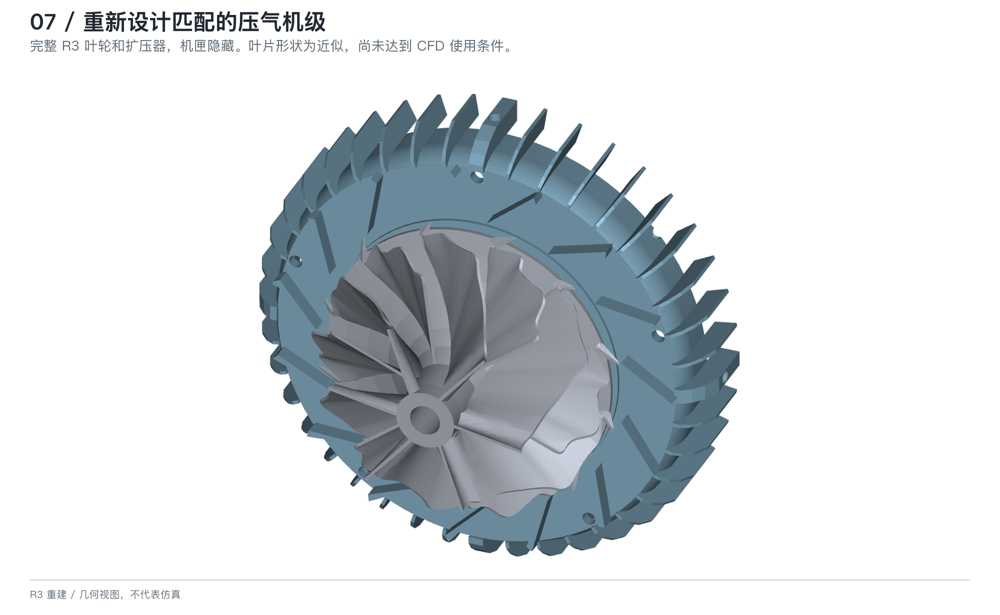

*一份从发动机重建模型出发、逐步形成可测量改进的实际开发计划。*



*图 1｜由所提供 STEP 文件直接渲染的当前 R3 重建模型。这是几何可视化图，不代表经过试验的发动机或仿真结果；部分叶片和轴承几何仍包含近似。*

关于 KJ66，有意思的问题已经不只是能否复现它的外形，还包括能否提出一项有依据的改进，并解释它为什么有效。

这套设计仍然是一个很有吸引力的起点。燃气轮机制造者协会（GTBA）将它描述为可以：

> “在普通模型工程车间里制造”

这种可接近性值得研究，却不能说明每个部件都容易制造，也不能说明它的性能已经达到最佳状态。[GTBA][gtba]

我的目标是：**在所携带的质量范围内获得更大的持续推力，同时在实际所需推力下减少燃油消耗。**我会按受控的顺序推进：建立可信基准，研究静止流道和燃烧，解决工作间隙，降低装机质量，最后再考虑协调的气动核心重设计。

**项目状态：**配套的 R3 评审记录指出，轴承、润滑、支撑和工作间隙仍有问题待解决。本文所用资料没有建立 R3 的推力、耗油量或耐久性测量结果。下文提出的是开发计划，不代表已经完成的修改，也不承诺一定获得某种增益。[项目来源详情](../../../kj66-optimization/SOURCE_NOTES.zh.md#project-context)

## 先定义什么叫“更好”

我会在整个项目中持续记录两个主要目标：

```text
装机推重比 = 持续推力 /（装机干质量 × g₀）
推力比油耗 = 燃油质量流量 / 推力
```

当推力和重量都用牛顿表示时，第一个比值没有量纲。第二个比值采用千克/牛顿·小时，燃油流量以千克/小时表示。NASA 将 TSFC 解释为燃油流量除以推力，并指出它会随速度和高度变化。[NASA：比油耗][tsfc]

对这个项目，我会把*装机干质量*定义为发动机、保留的进气和排气硬件、安装件、启动器、控制器、泵、阀、管路、电池以及干燥状态下的燃油系统硬件。可用燃油单独报告，不计入装机干质量。试车台设备不计入其中。裸发动机质量仍作为辅助数据保留。

这个测量边界很重要：把泵移到发动机外部，并不会让它从飞行器的质量中消失。

比较时应使用相同的燃油规格、环境条件、进气布置和测量方法。燃油经济性应在**相同的所需推力**下比较，最大持续推力单独报告。我还会记录温度、振动、运行稳定性和检查结果，把它们作为约束条件，避免为了一个更高的单项数字牺牲这些因素。

## 1. 让基准可信



*图 2｜轴系支撑与润滑区域。CAD 中连通的通道，无法证明轴承接触处确实有足够供油，也无法证明预紧力或工作间隙正确。*

我的第一项优化工作会从起点中消除不确定性。

R3 评审记录明确指出，实际轴承供油仍未验证。记录也把建模间隙和管路路径，与已经批准的工作间隙及制造细节区分开来。这些是项目当前的局限，不代表所有 KJ66 都存在润滑缺陷。[项目来源详情](../../../kj66-optimization/SOURCE_NOTES.zh.md#project-context)

**我会先建立的内容：**实际轴承规格、轮毂接口、轴向定位方案、预紧布置、材料分配、管路支撑和制造公差。每个关键特征都应标注为已验证、假设或待解决。

**建立方法：**核对图纸、CAD 和选定硬件；准备公差与热膨胀评估；随后通过经过适当评审的测试计划建立带仪器的基准。记录应把几何版本、配置、校准信息、运行条件和观察结果连接起来。

我会先追求可重复性，再设定推力目标。如果基准无法重复，一个看似有效的改进可能只是进气条件不同、传感器安装改变，或测量系统发生漂移。

**第一个有用的交付物是可信的参考基准，重点在验证，并逐步完善模型细节。**

## 2. 在重设计转子前先恢复压力



*图 3｜压气机级区域。初步研究会保留叶轮和导流叶片型面，先检查周围流道壁面和下游转弯。*

扩压器需要在不过度损失的情况下，把压气机出口的动压恢复为静压。回流通道还要完成转向和流量分配。Ling、Wong 和 Armfield 的一项 KJ66 研究同时考察了更大的叶轮和圆滑的扩压器转弯。他们的仿真在目标运行区域改善了性能，但在更高流量下变差；作者将其与转弯处的回流联系起来。[Ling 等，2007][ling]

我的结论是：先在发动机实际使用的运行区域内优化流道，不急于安装更大的叶轮。

**我会先改变的参数：**通道面积变化、轮毂与轮盖轮廓、径向到轴向的转弯，以及燃烧室前的局部限制。在第一轮研究中，我会保持转子叶片和静止导流叶片型面不变。扩压器叶片的变化会作为单独标识的气动重设计处理。

**候选方案的比较方法：**从少量参数和冷流模型开始，检查网格敏感性、一致的边界条件和质量守恒。在多个相关工作点比较静压恢复、总压损失、分离以及进入燃烧室的流量分布。

出口流动更均匀，并不自动代表方案成功，如果它消耗了过多压力；一个设计点上好看的结果，也不足以证明流道在其他运行区域仍然合适。

**接受标准：**改进应能通过整机评估，而非只让流道看起来更平滑或等值线图更漂亮。

### 为什么不直接提高转速？

Xiang、Schlüter 和 Duan 对 KJ66 压气机的研究提供了一个提醒。在 80,000 和 117,000 rpm 的仿真速度线上，峰值总压比从 1.54 上升到 1.96，而峰值绝热效率从 73% 降到 55%。作者将其描述为：

> “峰值绝热效率从 0.73 降低到 0.55”

这些结果属于该研究中的压气机，不能当作普遍适用的转速规则。压力比和效率的峰值未必出现在同一个质量流量点，它们也不等于整机效率。[Xiang 等，2017][xiang]



*图 4｜根据已发表的效率峰值重新绘制的图表，并非论文完整压气机图谱的复制品。这些数值来自研究报告，不代表 R3 的测量结果。[来源][xiang]*



*图 5｜分别报告的总压比峰值。更高的峰值压力本身无法证明发动机燃油经济性更好。[来源][xiang]*

## 3. 同时优化燃油分配与燃烧



*图 6｜重建燃烧室和燃油路径。图片用于定位子系统，不显示实测的燃油分配、火焰形状或温度场。*

Capata 和 Achille 认为原有 KJ66 混合布置会产生：

> “相当不均匀的空气与燃油混合物”

他们的论文研究了一个源自 KJ66 布局、规模更大的 50 kW 发电概念。它可以促成进一步研究，却没有量化能够转移到本 R3 的节油收益。作者还指出，完整的燃烧室仿真超出了当时可用的计算资源。[Capata 和 Achille，2018][capata]

Wang 和 Luo 的另一项基于 KJ66 的数值研究发现，燃烧室与涡轮的相互作用，以及部件之间的周向相对位置，会影响气动性能、热负荷和排放。这说明需要检查到达涡轮的流动，而不只观察火焰筒内部发生的事情。[Wang 和 Luo，2024][wang]

**我会优化的内容：**预定燃油分配、蒸发、燃烧室进气、压力损失和涡轮入口温度分布。

**研究方法：**先在受控的非点火流动装置上表征各支路供给，包括重复性和泄漏。随后单独研究空气分配。只有这些基础工作完成后，才进入反应流分析和经过适当评审的燃烧试验。

管路长度相等只是几何事实，无法证明各支路供油相等。冷流计算可以帮助了解空气分配，却无法建立燃烧效率或火焰稳定性。

**接受标准：**在约定推力下获得更低的 TSFC，同时满足压力损失、温度分布和稳定性要求。我会先把温度均匀性改善用于保留运行裕度，不会自动把它当成增加燃油的理由。

## 4. 优化工作间隙，不要只看冷态 CAD 间隙



*图 7｜冷态重建模型中的压气机与机匣接口。图中没有经过验证的间隙尺寸，也没有热变形结果。*

叶尖间隙同时涉及气动和机械问题。在一项针对混流压气机级的数值研究中——研究对象并非当前 KJ66——van Eck 等人发现，减小间隙可以改善压力比和效率。然而失速裕度与堵塞裕度的变化方向并不相同。更小的间隙在各方面都未必更好。[van Eck 等，2023][clearance]

**我会优化的目标：**一个可重复的工作间隙，在满足气动目标的同时保留机械和稳定性裕度。

作为一阶记录，我会写成：

```text
最小工作间隙 ≈ 冷态间隙 + 机匣膨胀 − 转子膨胀
                 − 其他会进一步缩小间隙的因素
```

公开的动态间隙建模也使用了相同的几何思想：机匣半径减去不断变化的转子和叶片包络。[动态叶尖间隙研究，2023][thermal]

**评估方法：**使用部件各自的温度和变形，纳入离心效应与轴承运动，同时考虑跳动和制造公差，避免重复计算。除稳态工作点外，还要检查瞬态条件。不能把一个排气温度分配给所有金属部件。

同样的工作还应覆盖轴向间隙、轴与管路之间的距离以及燃烧室支撑。对于当前重建模型，这些是仍待解决的设计检查，不能简化成随意削减几分之一毫米的机会。

**接受标准：**在有依据的公差和运行范围内不出现预测干涉，并明确记录剩余裕度和不确定性。本文不规定加工间隙。

## 5. 让涡轮和喷口与压气机匹配



*图 8｜涡轮与排气区域。部件形状用于定位，不能证明气动匹配正确。*

改进后的压气机仍需要涡轮驱动。BMT120 KS 升级研究说明了其中的困难：为了提供所需的涡轮功，在高转速下增加燃油后，重新设计的部件组合出现了过高温度。作者通过部件匹配研究这一问题，没有简单假定单个部件变好就能让整台发动机变好。[Oppong 等，2017][oppong]

排气也应纳入同一分析。NASA 的推力方程包含动量项和出口压力项；改变出口形状，不能保证推力增加。[NASA：推力方程][thrust]

**我会优化的内容：**压气机、燃烧室、涡轮和喷口的运行组合，而非单独优化排气锥。

**评估方法：**使用平衡质量流量和轴功的整机模型，把候选喷口面积和轮廓与推力、TSFC、温度以及压气机工作位置进行比较。任何上游修改都应触发新的匹配检查。

对于入选方案，还应进一步关注涡轮入口的不均匀性和损失。发动机模型使用平均温度，并不意味着入口实际均匀。

**接受标准：**发动机能在所需的持续运行点工作，不依赖过高温度、较低稳定性或没有依据的转速提升。

## 6. 去掉无效质量，同时保留工程裕度



*图 9｜结构和支撑部件的局部视图；外部附件及其质量没有显示。*

如果要减重，我会从称重后可追溯的零件清单开始，之后再评估机匣厚度。

商业设计表明，系统集成是独立于核心气动的一条开发方向。例如 JetCat 的 P100-RX-BL 说明讨论了集成阀门，以及减少外部软管和电缆连接。这展示了一种集成方法，不能据此建立 KJ66 改装的具体减重数值。[JetCat][jetcat]

**我会先研究的内容：**多余支架、重复接口、接头数量、管路路径和附件封装。比较时应覆盖完整装机系统，不能只看裸发动机。

**评估修改的方法：**分配材料和制造工艺，把 CAD 估算与称重或供应商质量数据核对，然后检查刚度、温度暴露、振动、可接近性和可维护性。合并后的部件仍需具备制造、检查和必要时更换的条件。

R3 燃烧室在 CAD 中合并为一个实体，本身不构成实际减重，也不能证明一体化制造工艺可行。

除非有适当的结构和热分析支持，我会把转子、轴、轴承支撑和承压机匣的去料留到第一轮轻量化之后。

**接受标准：**在保留必要功能和裕度的前提下降低装机质量。图纸上的质量减少，不等于飞行器上的质量减少。

## 7. 最后把气动核心作为系统重设计



*图 10｜重建压气机级的完整几何视图。近似叶片形状适合用于定位，不能据此声称已有经过验证的气动基准。*

更有野心的阶段会把叶轮和扩压器一起重设计，再把这一压气机级放回涡轮和喷口中评估。

Guo 等人使用试验设计和 CFD 流程，围绕效率、压力比和输入功率优化 SR-30 压气机。他们改变了叶轮出口半径、叶轮出口叶片角和扩压器入口叶片角。入选压气机的实验显示：

> “压力比提高了 7.5%”

这是另一台发动机上的压气机结果，不能据此推断推力提高 7.5%，也不能视为对 KJ66 的预测。[Guo 等，2014][guo]

**我会改变的内容：**先选取少量、容易解释的参数，不让优化器一次改动所有曲面。

**搜索方法：**建立可信几何，采样设计空间，在多个工作点运行 CFD，识别敏感参数并比较取舍。响应面或代理模型可以加速搜索，但最终候选仍要回到直接仿真和机械评估。

我会保留一组非支配候选方案：改善一个目标就必须牺牲另一个目标的方案。这样可以把取舍展示出来，避免把它隐藏在一个方便的综合分数里。

**接受标准：**气动改进需要通过整机匹配、结构检查、制造约束和实验验证。

## 我会怎样组织下一轮迭代

下面的顺序是我提出的计划，当前没有任何阶段被宣称已经完成。

| 阶段 | 主要问题 | 进入下一阶段前需要的证据 |
| --- | --- | --- |
| 建立基准 | 几何、硬件和测量是否描述同一台发动机？ | 关键接口得到解决，假设有记录，参考数据可重复。 |
| 研究非叶片改动 | 静止流道、燃油分配和装机方式能否改善目标？ | 可比较的部件结果和整机预测，同时说明不确定性与约束。 |
| 开发匹配核心 | 新的叶轮/扩压器/涡轮组合是否值得增加复杂度？ | 可信几何、兼容的流量和功率需求，以及可接受的机械裕度。 |
| 验证改进 | 制造出的修改是否实现了预测结果？ | 可重复的测量、检查结果，以及对模型与试验差异的解释。 |

我会用一套层级化模型连接这些阶段。Deng 等人展示了一种 KJ66 方法，把压气机和涡轮 CFD 嵌入低阶发动机模型，并将偏离设计点的预测与参考地面试验数据比较。它可以作为连接部件分析和发动机行为的有用先例，不代表这个项目已经拥有同样的模型。[Deng 等，2024][deng]

我的工作循环会是：

```text
定义一个假设 → 创建受控的几何变体
→ 评估部件 → 重新匹配整机
→ 评估热和机械约束
→ 测试有依据的候选方案 → 更新模型
```

每个变体都应有一个主要问题。成功的修改可以随后组合，再次检查它们之间的相互作用。

测试记录应包含几何版本、质量边界、燃油规格、运行条件、推力和燃油流量数据、温度测量、校准信息及重复性。我会把增益和不确定性放在一起报告；当测量无法把它与基准区分开时，就不会把它称为已经确立的结果。

高速或点火试验需要单独评审的安装、适当的防护、远程操作、仪器和保护限制。本文是一份供后续评审使用的研究路线图，不构成制造发布文件，也不构成运行规程。

## 成功会是什么样？

我会先建立经过验证的基准，再以它为参照设定目标。例如，在约定推力下把 TSFC 降低 **10%**，可以作为有用的研究目标。它不构成预测，也不会以牺牲所需持续输出或耐久性为代价接受这个目标。

组合目标背后的算术很有启发性。假设推力增加 10%，装机质量减少 10%，推重比的变化为：

```text
1.10 / 0.90 = 1.222…  →  增加 22.2%
```

这个计算无法说明两项变化是否可行，也无法说明它们会怎样影响燃油消耗。工程工作就是要查清楚这些问题。

对我的 KJ66 来说，下一项最值得研究的主题是：**在已经核实润滑和间隙基准的基础上，研究保留转子的扩压器与回流通道，同时记录装机质量。**

目标是得到一台更好的发动机，并清楚、可重复地解释它为什么更好；渲染图的冲击力和单次试验中的孤立高数字都不作为评价重点。

---

## 资料与延伸阅读

上文的短引文均为直接摘录。提出的试验、接受标准和开发顺序属于本文的工程方案。其他发动机的结果均已标明来源，文中的数值没有被当作 R3 的测量结果。

**1. Gas Turbine Builders Association。**[KJ66 设计说明][gtba]。用于历史设计、制造和材料背景。

**2. NASA Glenn Research Center。**[比油耗][tsfc]。用于 TSFC 定义及运行条件的重要性。

**3. Xiang、J.；Schlüter、J. U.；Duan、F.（2017；在线首发于 2016）。**[Study of KJ-66 micro gas turbine compressor: Steady and unsteady Reynolds-averaged Navier–Stokes approach][xiang]。DOI：10.1177/0954410016644632。

**4. Ling、J.；Wong、K. C.；Armfield、S.（2007）。**[Numerical Investigation of a Small Gas Turbine Compressor][ling]。第 16 届 Australasian Fluid Mechanics Conference，第 961—966 页。作者上传的会议论文。

**5. Capata、R.；Achille、M.（2018）。**[Design and Optimization of Fuel Injection of a 50 kW Micro Turbogas][capata]。*Designs*，2(2)，14。DOI：10.3390/designs2020014。

**6. Wang、H.；Luo、K. H.（2024）。**[Fully Coupled Whole-Annulus Investigation of Combustor–Turbine Interaction with Reacting Flow][wang]。*Energies*，17(4)，873。DOI：10.3390/en17040873。

**7. van Eck、H.；van der Spuy、S. J.；Gannon、A. J.（2023）。**[The Effect of Impeller Tip Clearance on the Performance of a MGT Mixed Flow Compressor Stage Fitted with a Crossover Diffuser][clearance]。*Aerotecnica Missili & Spazio*，102，219—231。DOI：10.1007/s42496-023-00160-x。

**8. Chinese Journal of Aeronautics（2023）。**[New model-based method for aero-engine turbine blade tip clearance measurement][thermal]。用于动态间隙的几何关系，不作为 KJ66 间隙规格。

**9. Oppong、F.；van der Spuy、S. J.；von Backström、T. W.（2017）。**[Upgrading the BMT120 KS micro gas turbine][oppong]。*R&D Journal*，33，22—31。

**10. NASA Glenn Research Center。**[推力方程][thrust]。用于动量和压力对推力的贡献。

**11. JetCat。**[P100-RX-BL 产品说明][jetcat]。用于附件集成的制造商案例，不作为独立比较测试。

**12. Guo、S.；Duan、F.；Tang、H.；Lim、S. C.；Yip、M. S.（2014）。**[Multi-objective optimization for centrifugal compressor of mini turbojet engine][guo]。*Aerospace Science and Technology*，39，414—425。DOI：10.1016/j.ast.2014.04.014。

**13. Deng、W.；Wei、Z.；Ni、M.；Gao、H.；Ren、G.（2024）。**[Direct multi-fidelity integration of 3D CFD models in a gas turbine with numerical zooming method][deng]。*Journal of the Global Power and Propulsion Society*，8，166—176。DOI：10.33737/jgpps/186054。

*准备日期：2026 年 10 月 4 日。图片来源和限制见[图片说明](../../../kj66-optimization/IMAGE_CREDITS.zh.md)。*

[gtba]: https://gtba.co.uk/engine_designs/kj66.php
[tsfc]: https://www.grc.nasa.gov/www/k-12/airplane/sfc.html
[xiang]: https://journals.sagepub.com/doi/10.1177/0954410016644632
[ling]: https://www.researchgate.net/publication/43472634_Numerical_Investigation_of_a_Small_Gas_Turbine_Compressor
[capata]: https://www.mdpi.com/2411-9660/2/2/14
[wang]: https://www.mdpi.com/1996-1073/17/4/873
[clearance]: https://link.springer.com/article/10.1007/s42496-023-00160-x
[thermal]: https://www.sciencedirect.com/science/article/pii/S1000936122002205
[oppong]: https://scielo.org.za/scielo.php?pid=S2309-89882017000100009&script=sci_arttext
[thrust]: https://www1.grc.nasa.gov/beginners-guide-to-aeronautics/thrust-force/
[jetcat]: https://www.jetcat.de/en/productdetails/produkte/jetcat/produkte/RC%20ENGINES/Engines/p100_rx-bl
[guo]: https://doi.org/10.1016/j.ast.2014.04.014
[deng]: https://doi.org/10.33737/jgpps/186054
