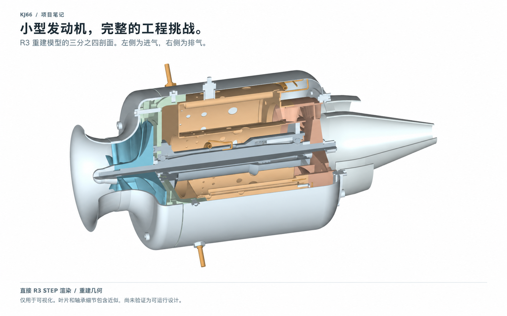
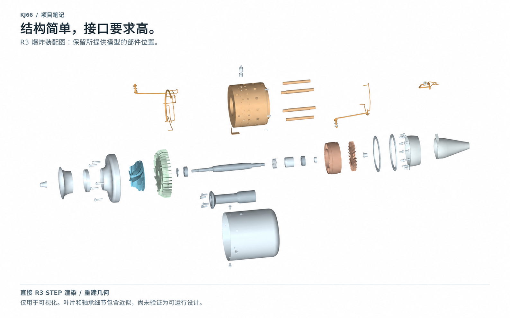
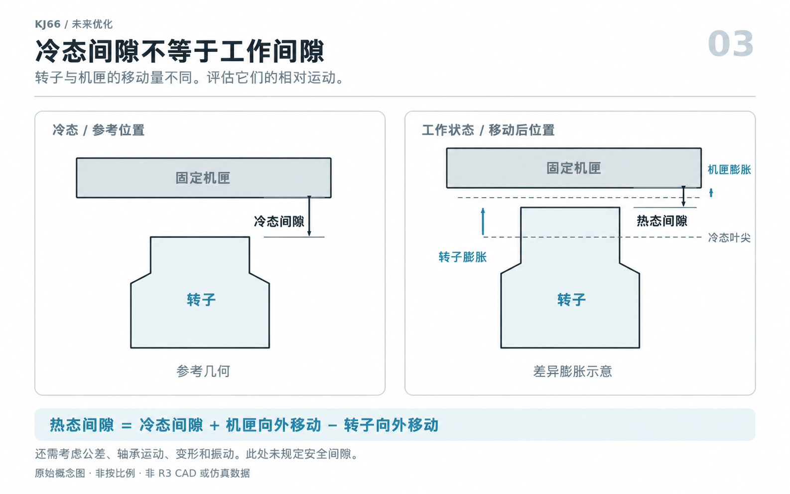
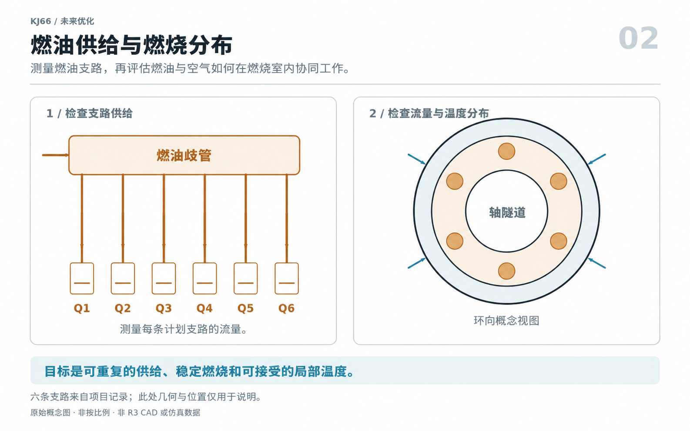
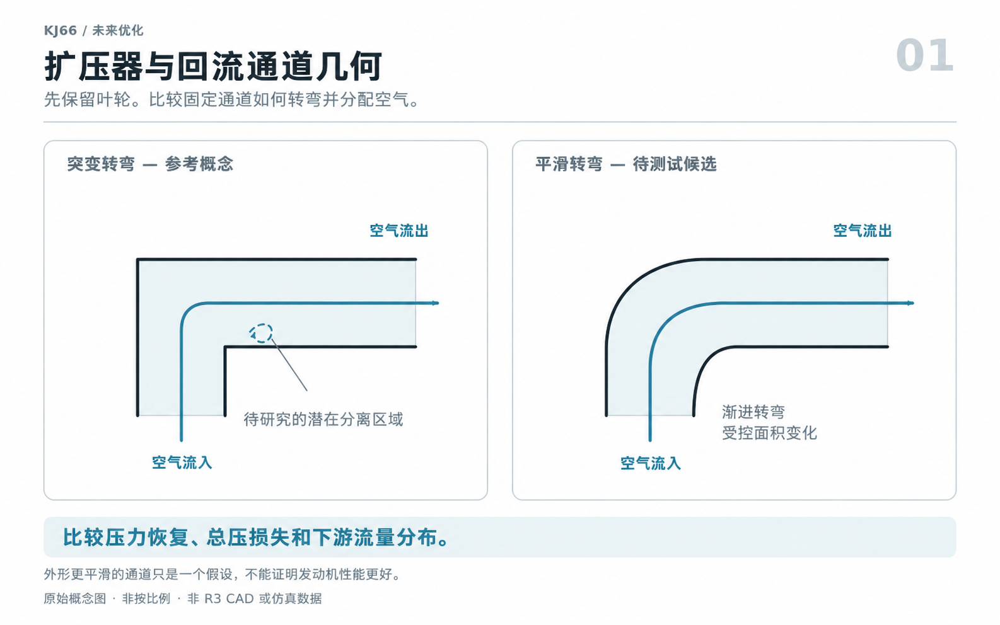
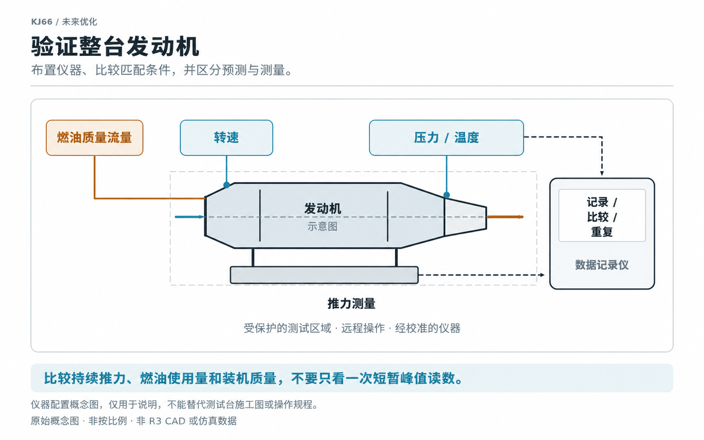

*我为什么觉得 KJ66 适合用来学习，也为什么不会把它当成解决所有推进问题的现成答案。*

*图 1｜这张图来自项目 R3 的三分之四剖面 STEP 文件。它展示的是重建 CAD 几何，不是照片、仿真结果或已经发布的制造图纸；叶片和轴承细节有些是近似画法。*

小型喷气发动机很容易让人产生兴趣。把外壳切开以后，还能看到压气机、燃烧室、涡轮、轴和支撑件怎样挤在一个很小的空间里一起工作。

在重建 KJ66 时，我慢慢发现，一个比“它能产生多大推力”更值得问的问题是：**它适合做什么样的起点？选择它以后，我会遇到哪些困难？**

我认为 KJ66 很适合当作学习和开发的起点。这里的“适合”不等于它最容易做、花钱最少，也不等于它能直接变成可靠的飞行设备。

阅读全文时，请记住一个区别：**历史上的 KJ66 和本项目的 R3 模型，证据来源不同。**项目记录把 R3 定义为还在检查中的重建模型，润滑、轴承和工作间隙仍有问题要解决。因此，公开资料里的 KJ66 性能不能直接当作 R3 的实测成绩。

## 首先，KJ66 是什么？

KJ66 是一台微型涡轮喷气发动机。空气先进入离心式压气机，被压得更紧；然后进入燃烧室加热；热气推动轴流式涡轮，最后从喷口排出。压气机和涡轮由同一根轴连接。一篇 2024 年的整机建模研究介绍了这种布局，并拿公开的海平面试验数据做了比较。[2][gpps]

为了帮助我们想象它有多大，燃气轮机制造者协会（GTBA）列出了一组历史参考数据。[1][gtba]

| 属性 | GTBA 历史参考值 |
| --- | ---: |
| 外径 | 110 mm |
| 长度 | 240 mm |
| 发动机质量 | 0.93 kg |
| 推力 | 75 N |
| 最高转速 | 117,000 RPM |

这些数字描述的是来源页面上的参考发动机。不同制造者做出的 KJ66 可能有差别。它们也不能当作 R3 的批准工作范围，或一整套装机系统的完整规格。

## 它为什么值得作为起点：我看到的优点

### 1. 它能让整台发动机变得容易理解

对我来说，最大的优点是它有很好的教学价值。它的结构比较紧凑，正好可以把它看成一条完整的链路：空气进入压气机，在燃烧室里得到热量，经过涡轮，最后从排气段离开。涡轮还要提供足够的轴功，才能带动压气机转动。[2][gpps]

写项目笔记时，一个问题很容易带出下一个问题。研究压气机时，我会继续看扩压器、燃油分配、轴承支撑、热膨胀和测量方法。先从一个边界清楚的参考设计开始，再逐个检查接口，会比一开始就凭空设计整台发动机更容易管理。

它的意义是把问题排好顺序，让学习过程更有条理。

### 2. 它有实际制造的历史背景

GTBA 把这套设计介绍为适合模型工程车间的布局。它使用了源自涡轮增压器的压气机，也使用了按正确叶型制造的铸造涡轮。这样的背景很有帮助，因为我们能把电脑里的几何图形和真实的材料、加工方法联系起来。[1][gtba]

还有一个很有参考价值的例子。Max Prototypes 说，他们先做了一台 KJ66 型发动机，用来熟悉材料和工艺，之后才开发自己的 M400。这说明已有设计可以用来练习和准备，但每个人的材料、设备和结果都可能不同。[4][max]

所以，我会把 KJ66 当作学习工程习惯的起点，同时逐件确认零件是否适合自己的加工方法，不能只因为它出现在旧图纸里，就认为它一定能在普通车间里做出来。

### 3. 有公开研究可以继续追踪

关于 KJ66 的资料不只来自爱好者的讨论。Xiang、Schlüter 和 Duan 用计算流体力学（CFD）研究了它的压气机。CFD 可以用电脑计算空气怎样流动。Deng 等人后来又把压气机和涡轮的计算放进整机模型里。[3][xiang] [2][gpps]

这些论文给了我可以继续追问的问题，也提供了建立模型的方法。它们能帮助我决定先研究哪一部分，以及怎样把一个零件放回整台发动机中比较。

论文不能替我验证 R3 的叶片。可与几乎没有资料的设计相比，手边有公开研究仍然是很大的帮助。

### 4. 它支持一个可控的开发计划

我可以在现有布局上做小范围研究，每次只改变少数几个因素。一个版本研究回流通道，另一个版本研究燃油输送，第三个版本检查支撑结构或附件的重量。

这只是我建议的工作方法，原始 KJ66 并没有被证明是一个专门的模块化研究平台。这样安排的好处是，我每次只提出一个问题，保留一个基准版本，再说明某项改动为什么留下或被放弃。

对个人工程博客来说，这很有价值。文章会记录一连串有理由的选择，读者也能看懂每一步怎样得到下一步。

*图 2｜这是所提供的 R3 爆炸排列图。零件在这里保持原样，没有重新设计。它适合帮助读者看清零件之间的关系；接口、材料和间隙能否真正制造，还要另外检查。*

## 它的吸引力需要哪些限定：我看到的不足

### 1. 紧凑的涡轮喷气发动机不等于经济的推进系统

小型涡轮喷气发动机没有大型风扇或螺旋桨，这正是它看起来简洁的原因，也带来了推进方面的取舍。NASA 解释过，涵道气流可以在核心燃油流量变化不大的情况下增加推力。涡轮喷气发动机没有这部分涵道气流。[6][nasa-fan]

因此，如果飞机飞得较慢、又很看重续航时间，我会先比较不同的推进方式，再判断 KJ66 是否合适。我不能先假定它的核心效率会更高，也不能把这句话当作 R3 和某个螺旋桨系统之间的实测比较。

我会关注**推力比油耗**（TSFC）。它的意思是：每产生一单位推力，需要消耗多少燃油。NASA 说明过，TSFC 会随速度和高度改变，所以比较时必须写清测试条件。[5][nasa-sfc]

静态推力很有参考价值，但单凭这个数字，无法推算能飞多久、飞行时是否省油，或飞机需要带多少燃油。

### 2. 布局简单不代表机械系统宽容

R3 的项目记录让这个问题变得很具体。轴承型号、轴承预紧（让轴承保持合适压力的设置）、润滑供给和热间隙假设都还没有解决。这些是当前重建模型的限制，不能用来判断每一台原始 KJ66 都有轴承或润滑缺陷。

冷态 CAD 里看到的间隙，只是发动机没有升温时的起点。在判断间隙是否合适前，还要考虑不同零件受热后会怎样移动、高速旋转会带来的轻微变形、制造尺寸误差，以及轴承的运动。

另一项关于微型燃气轮机压气机级的研究也提醒了我：叶尖间隙变小，压比和效率可能提高，但失速裕度和堵塞裕度的变化不一样。失速裕度可以理解为“离开稳定状态前还剩多少余量”，堵塞裕度则是“气流快要被挤住前还剩多少余量”。间隙更小，不能保证所有指标都会变好。那项研究针对的是混流压气机级，不能直接套到 R3 的几何上。[7][clearance]

这就是机械方面最容易被忽略的地方：外观看起来简单，实际却可能需要很严的尺寸控制，还要应对温度变化。

*图 3｜冷态间隙和工作间隙不是同一个数字。这张概念图只用来说明相对运动，没有规定安全间隙，也没有预测 R3 会变形多少。*

### 3. 燃油与燃烧系统需要的不只是整齐的管路

R3 的燃油方案有六条支路，为六根蒸发管供油。项目记录也写明，管路还在检查阶段，轴承的实际供油没有验证。CAD 里画出相互连通的孔道，只能说明设计想法，不能说明供油系统真的能工作。

所以，我关心的不只是管子能否装进去。我还要检查每条支路分到多少燃油、每次分配是否相近，以及燃油和进入燃烧室的空气怎样互相影响。我会观察燃烧是否稳定、温度是否均匀，不能只看一次排气温度就宣布成功。

这使项目更有学习价值，也让它离可用硬件更远。装配图画得整齐，不能代替对内部流动过程的研究。

*图 4｜六条支路表示项目记录中的一种布局。位置和比例用于解释思路，不代表精确的 KJ66 几何；图中也没有实测流量或温度分布。*

### 4. 更高转速和更好的单个零件，不保证整台发动机更好

一项 KJ66 压气机研究给了我一个很重要的提醒。作者的仿真显示，转速从 80,000 RPM 提高到 117,000 RPM 时，峰值总压比从 1.54 增加到 1.96，但峰值绝热效率从 0.73 降到 0.55。这些数字是压气机特性图上的峰值。这里的总压比可以简单理解为压缩前后的气压比，绝热效率表示压缩过程有多有效。它们不能代表整台发动机的效率，也不能当作所有发动机都适用的转速规律。[3][xiang]

我从中学到的做法是，不要只盯着一个好看的数字。压力提高，可能也会让轴需要更大的功率。压气机和涡轮必须配合工作，所以各部件能否配合很重要。[2][gpps]

我会先保留现有转子，研究周围的扩压器和回流通道。最初的研究也会保留静止导向叶片的形状。一个候选方案要在目标工作范围内持续带来好处，外形看起来更顺滑还不够。

*图 5｜这是一个待研究的方向，还没有证明它一定有效。箭头只用来解释气流方向，并非 CFD 流线。更平滑的通道仍要检查压力损失、流量分配和各部件能否配合。*

### 5. 完整的装机系统比发动机核心更大的项目

只有发动机核心的模型，不能代表真正运行时需要的全部东西。我的质量和装机（安装到飞机上）预算还要包括启动器、控制器、泵、阀、管路、安装支架和工作电池。我会把燃油单独列出来，再放回整项任务中比较。

现代商用系统可以让我们看到集成工作的复杂程度。JetCat 的 P100-RX-BL 文档介绍了集成阀门、煤油启动和更少的外部连接。这只是制造商对自己的封装和控制方案的说明，不能当作独立的可靠性比较或购买建议。[8][jetcat]

KJ66 适合动手研究，也意味着个人重建者要承担更多集成工作。在采购计划没有算入精密零件、失败的迭代、仪器和测试之前，我不会承诺总成本更低。

旧图纸也可能很难找到。GTBA 的 KJ66 页面现在说明图纸已经不再提供。历史资料很有用，但它和一套仍受支持、授权完整的现代制造资料包并不相同。[1][gtba]

### 6. 测试、噪声、热量和维护都属于使用成本

微型涡轮是一种需要严格控制条件的实验设备。GTBA 的操作规范提到高温排气、火灾、零件飞出、进气危险、听力损伤、受控测试区域和定期检查。这些是模型燃气涡轮通常要面对的责任，不能用来证明 KJ66 有独有的安全问题。[9][safety]

对这个项目，我会从最开始就安排工程评审、防护措施、合适的测试装置和有经验的人协助。本文和图片都不能当作操作说明。

要做出可以重复的测试，需要时间，也需要合适的场地。决定继续推进以前，就应该把这些条件算进项目成本，不能等漂亮零件做完以后才发现缺少测试条件。

*图 6｜测量是从“看起来有希望”走向“能够证明”的桥梁。这是仪器配置概念图，不能代替测试台施工图，也不能代替完整的安全布局。*

## 对这个具体项目的公平评估

我会把每个还没有解决的 R3 问题分开看，不能把它们全部叫作“KJ66 的缺点”。至少可以分成三类：

| 类别 | 应包含的内容 |
| --- | --- |
| 架构层面的取舍 | 涡轮喷气推进，以及它是否适合预定任务。 |
| 制造相关的责任 | 制造质量、转子评估、控制系统、装机、检查和测试。 |
| 当前 R3 的限制 | 近似的叶片与轴承几何、尚未解决的接口，以及所提供记录中还没有建立的实测性能基线。 |

最后一类内容只说明项目资料目前的状态，不能推广到所有 KJ66 发动机。

同样，我不会把历史上的成功直接变成新重建模型的可靠性评级。真正的判断应该看具体构型、测量、检查和运行记录。仅凭模型名称，证据还不够。

## 我会先改进什么？

我建议沿用之前的优化顺序：先做出可信的基线，再想办法减少损失，暂时不急着重做旋转部件。

第一步，我会处理轴承、润滑、材料和工作间隙的假设。同时建立真实的质量预算，再研究扩压器、回流通道和燃油分配。压气机和涡轮的匹配重设计放到后面，等几何资料可靠、整机模型完成后再决定。

成功可以有几种清楚的定义：在装机质量不变时让推力保持更久；在目标推力下少用燃油；或者得到更稳定、更耐用、每次结果更接近的工作状态。在有相关测量以前，这些都只能算目标，不能算已经证明的结果。

四张配套概念图也可以通过这张[优化总览图](/jet-engine/images/kj66/pros-and-cons/07-optimization-overview-zh.png)查看。

## 我的结论：选择它要有正确的理由

如果目标是理解小型涡轮喷气发动机、研究一套结构清楚的布局，并记录 CAD 怎样一步步走向证据，我认为 KJ66 是很好的起点。

如果主要目标是尽快得到有完整支持的飞行硬件、减少装机工作，或为重视续航的任务寻找推进系统，就应该在开始重建前先比较其他方案。

这并不是在否定这台发动机。恰恰因为它会把人带到真实的工程问题面前，我才对它感兴趣。**KJ66 能让人更容易走进工程，却不能替人绕过工程。**

这个项目最好的结果，是做出一台能够用测量说明自己有哪些优点、哪些限制，以及下一步怎样改进的发动机。

---

## 参考资料与图片说明

以下外部参考资料于 **2026 年 10 月 4 日**核查。文中分开说明历史规格、已发表的仿真、制造商说明、项目记录和我提出的开发顺序。这里没有报告 R3 的独立性能或耐久性测试。

1. **燃气轮机制造者协会（GTBA）— [KJ66][gtba]。**历史规格、制造背景，以及图纸不再提供的说明。页面列出的转速不构成这台重建模型的运行许可。
2. **Deng, W., Wei, Z., Ni, M., Gao, H. 和 Ren, G.（2024）。**[使用数值缩放方法将 3D CFD 模型直接进行多保真度整合到燃气轮机中][gpps]。*Journal of the Global Power and Propulsion Society*，8，166–176。DOI：10.33737/jgpps/186054。KJ66 整机建模研究，不用于验证 R3。
3. **Xiang, J., Schlüter, J. U. 和 Duan, F.（2017；在线发表于 2016）。**[KJ-66 微型燃气轮机压气机研究：稳态与非稳态雷诺平均 Navier–Stokes 方法][xiang]。*Proceedings of the Institution of Mechanical Engineers, Part G*，231(5)，904–917。DOI：10.1177/0954410016644632。
4. **Max Prototypes—[已完成项目][max]。**其以 KJ66 型发动机作为开发 M400 前准备工作的第一手描述。其硬件和结果属于另一个项目。
5. **NASA Glenn Research Center—[比油耗][nasa-sfc]。**TSFC 的定义及其对运行条件的依赖。
6. **NASA Glenn Research Center—[涡扇推力][nasa-fan]。**关于核心和涵道对推力、燃油经济性贡献的解释；属于一般推进背景，不能视为 KJ66 比较试验。
7. **van Eck, H., van der Spuy, S. J. 和 Gannon, A. J.（2023）。**[叶轮叶尖间隙对采用交叉扩压器的混流压气机级性能的影响][clearance]。*Aerotecnica Missili & Spazio*，102，219–231。DOI：10.1007/s42496-023-00160-x。研究对象是其他压气机级，本文用它说明间隙与稳定性之间的取舍。
8. **JetCat—[P100-RX-BL 产品文档][jetcat]。**制造商对集成阀门、启动方式和连接的说明。本文没有声称当前价格或进行了同类性能排名。
9. **燃气轮机制造者协会—[模型燃气轮机安全运行规范，第 10 版][safety]。**一般工程与运行指导，不能替代特定发动机、装机或所在地适用的要求。

**图片：**图 1–2 直接由所提供的 R3 STEP 文件渲染。图 3–6 与优化总览图是本项目提供的概念图。中文版配图是在相同构图基础上制作的中文文字版本；它们属于本项目的概念素材，来源并非第三方论文图片、实测数据或经过验证的制造图纸。图片出处已在上面的图注和来源说明中标明。

[gtba]: https://gtba.co.uk/engine_designs/kj66.php
[gpps]: https://doi.org/10.33737/jgpps/186054
[xiang]: https://doi.org/10.1177/0954410016644632
[max]: https://maxprototypes.com/pages/projects
[nasa-sfc]: https://www.grc.nasa.gov/www/k-12/airplane/sfc.html
[nasa-fan]: https://www.grc.nasa.gov/www/k-12/airplane/turbfan.html
[clearance]: https://doi.org/10.1007/s42496-023-00160-x
[jetcat]: https://www.jetcat.de/en/productdetails/produkte/jetcat/produkte/RC%20ENGINES/Engines/p100_rx-bl
[safety]: https://gtba.co.uk/codes/codedoc_22.php
